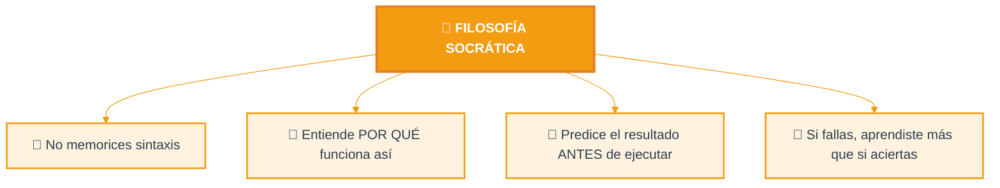
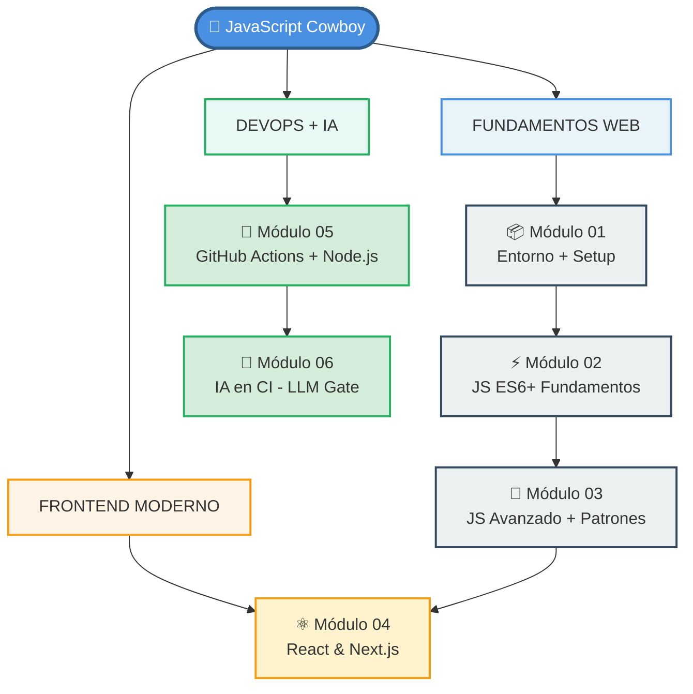
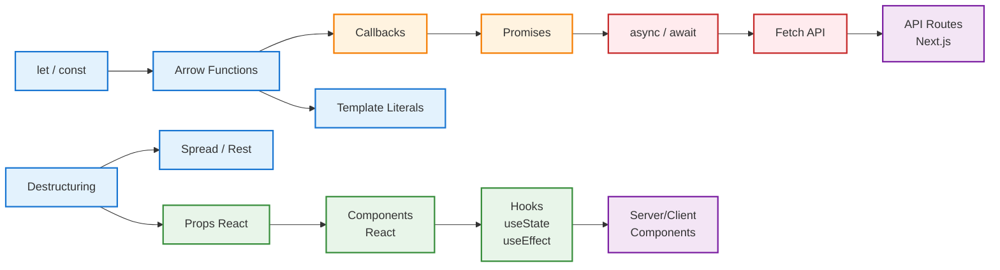

# 🤠 JavaScript Cowboy — De DevOps a Full-Stack con IA

> _"No aprendas a programar para ser programador; aprende a programar para resolver problemas que importan."_

[]()
[]()
[]()

## 🎯 ¿Qué es este curso?

Un camino de aprendizaje **práctico y socrático** para un profesional DevOps que quiere dominar el desarrollo frontend moderno e integrar IA en aplicaciones web. Cada módulo construye sobre el anterior, con preguntas que desafían tu comprensión antes de darte respuestas.



---

## 🗺️ Mapa del Curso



---

## 📚 Módulos

| #   | Módulo                                                             | Descripción                                                                 | Prerequisito |
| --- | ------------------------------------------------------------------ | --------------------------------------------------------------------------- | ------------ |
| 01  | [Entorno y Herramientas](docs/01-entorno-y-herramientas/README.md) | Node.js, VS Code, configuración Debian/WSL                                  | Ninguno      |
| 02  | [JavaScript Fundamentos](docs/02-javascript-fundamentos/README.md) | Variables, funciones, arrow functions, template literals, desestructuración | Módulo 01    |
| 03  | [JavaScript Avanzado](docs/03-javascript-avanzado/README.md)       | Async/await, closures, prototypes, modules, Event Loop                      | Módulo 02    |
| 04  | [React y Next.js](docs/04-react-nextjs/README.md)                  | Componentes, hooks, Server/Client Components, App Router, DB                | Módulo 03    |
| 05  | [GitHub Actions con Node.js](docs/05-github-actions/README.md)     | Workflows CI/CD, Composite Actions, deploy K8s/AWX                          | Módulo 03    |
| 06  | [IA en CI/CD (LLM Gate)](docs/06-ia-cicd-llm/README.md)            | Validación CI con Ollama/Llama y Copilot CLI                                | Módulo 05    |

---

## 🧭 ¿Por dónde empiezo?

```
¿Tienes Node.js + VS Code instalado?
    │
    ├── NO ──→ Módulo 01 (Entorno)
    │
    ├── SÍ, pero no sé JS moderno ──→ Módulo 02 (Fundamentos)
    │
    ├── Sé JS, quiero React ──→ Módulo 04 (React/Next.js)
    │
    └── Quiero GitHub Actions con JS ──→ Módulo 05 (Actions)
```

---

## 🤖 Tutores Interactivos (Método Socrático con IA)

Incluye tres aplicaciones Next.js para practicar con chat socrático en [`tutor/`](tutor/):

| Tutor                | Tecnología                   | Puerto  | Comando                                          | CI                                                      |
| -------------------- | ---------------------------- | ------- | ------------------------------------------------ | ------------------------------------------------------- |
| 🤠 **Copilot Tutor** | GitHub Copilot API           | `:3000` | `cd tutor/copilot-tutor && docker compose up -d` |  |
| 🦙 **Llama Tutor**   | Ollama (LLM local, sin APIs) | `:3001` | `cd tutor/llama-tutor && docker compose up -d`   |    |
| 🔌 **MCP Tutor**     | GitHub Models API (MCP)      | `:3002` | `cd tutor/mcp-tutor && docker compose up -d`     |      |

Los tres tutores usan el mismo enfoque pedagógico: **nunca dan la respuesta directa**, te guían con preguntas para que entiendas el concepto por ti mismo.

💡 **Nota**: Cada tutor tiene validación continua automática — los cambios se testean con GitHub Actions antes de merge. Ver [tutor/README.md](tutor/README.md) para detalles de CI/CD.

---

## 📊 Diagrama de Dependencias entre Conceptos



---

## ✅ Checklist de Progreso

Marca tu avance editando este archivo:

- [ ] **Módulo 01** — Entorno configurado (Node.js + VS Code)
- [ ] **Módulo 02** — JS Fundamentos dominados
- [ ] **Módulo 03** — JS Avanzado comprendido
- [ ] **Módulo 04** — Primera app React/Next.js funcionando
- [ ] **Módulo 05** — Primer workflow GitHub Actions creado
- [ ] **Módulo 06** — CI Gate con LLM implementado

---

## 🔑 Convenciones del Curso

| Icono | Significado                                                           |
| ----- | --------------------------------------------------------------------- |
| 🤔    | **Pregunta socrática** — Intenta responder ANTES de leer la respuesta |
| 💡    | **Concepto clave** — Memoriza esto                                    |
| ⚠️    | **Error común** — Evita caer aquí                                     |
| 🛠️    | **Ejercicio práctico** — Ejecuta el código                            |
| 📊    | **Diagrama** — Visualiza el flujo                                     |
| 🔗    | **Conexión** — Así se usa en el mundo real                            |

---

## 📜 Licencia

Este material está bajo licencia MIT. Ver [LICENSE](LICENSE).
