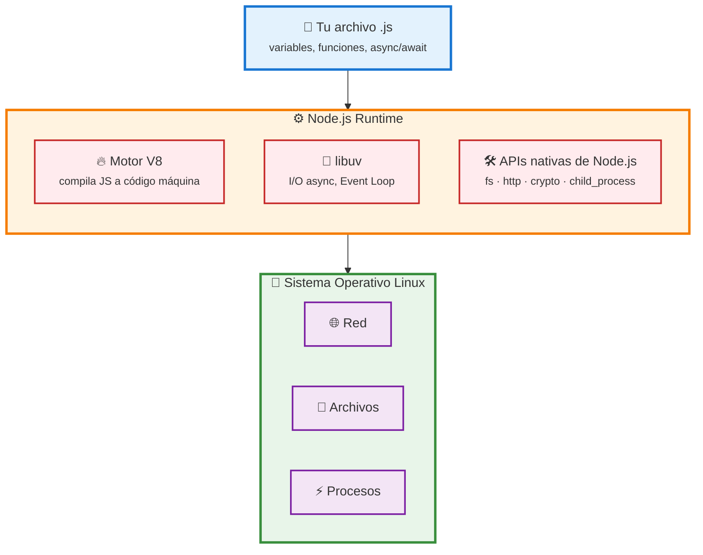

# 01 · Instalación de Node.js en Debian/WSL

> 🤔 *Si JavaScript nació para el navegador, ¿por qué necesitamos Node.js para ejecutarlo en tu servidor?*

**Respuesta**: Node.js saca JavaScript del navegador y lo lleva a tu terminal. Es el mismo motor V8 de Chrome, pero sin DOM. Esto te permite: ejecutar scripts, crear servidores HTTP, y — lo que nos importa — construir apps Next.js.

---

## 💡 Conceptos Clave

| Concepto | Qué es | Para qué lo usas |
|----------|--------|-------------------|
| **Node.js** | Runtime JS fuera del navegador | Ejecutar código JS en servidor/terminal |
| **npm** | Gestor de paquetes | Instalar dependencias (React, Next.js, etc.) |
| **npx** | Ejecutor de paquetes | Ejecutar comandos sin instalar globalmente |
| **REPL** | Read-Eval-Print Loop | Probar código línea a línea en terminal |

---

## 🛠️ Instalación (Node.js 22 LTS)

### Paso 1 — Actualizar sistema e instalar desde NodeSource

```bash
sudo apt update
curl -fsSL https://deb.nodesource.com/setup_22.x | sudo -E bash -
sudo apt install nodejs -y
```

### Paso 2 — Verificar

```bash
node -v   # Debe mostrar v22.x.x
npm -v    # Debe mostrar 10.x.x
```

> ⚠️ **Error común**: Si `node -v` muestra `v16.x` o inferior, es la versión del repositorio de Debian por defecto. Asegúrate de haber añadido el repo de NodeSource primero.

---

## 🛠️ Tu Primer Archivo JavaScript

### Paso 1 — Crear directorio de pruebas

```bash
mkdir -p ~/js-pruebas && cd ~/js-pruebas
```

### Paso 2 — Crear `prueba.js`

```javascript
// ~/js-pruebas/prueba.js
let nombre = 'Colega DevOps';
const sumar = (a, b) => a + b;
const mensaje = `Hola ${nombre}, 5+3=${sumar(5, 3)}`;

async function simularIA() {
  return new Promise(resolve =>
    setTimeout(() => resolve('Respuesta IA lista'), 1000)
  );
}

simularIA().then(result => console.log(result));
console.log(mensaje);
```

### Paso 3 — Ejecutar

```bash
node prueba.js
```

**Salida esperada:**
```
Hola Colega DevOps, 5+3=8
Respuesta IA lista
```

> 🤔 *¿Por qué `"Hola Colega..."` aparece ANTES que `"Respuesta IA lista"` si el `setTimeout` es solo 1 segundo?*
>
> Porque JavaScript es **single-threaded con Event Loop**: el `console.log` síncrono se ejecuta inmediatamente, mientras que la Promise va a la cola de microtareas. Profundizaremos en el [Módulo 03](../03-javascript-avanzado/01-event-loop.md).

---

## REPL Interactivo (Opcional)

Prueba código línea a línea sin crear archivos:

```bash
node
> 2 + 2
4
> const x = [1,2,3]
> x.map(n => n * 2)
[ 2, 4, 6 ]
> .exit
```

Útil para explorar APIs rápidamente. Sal con `.exit` o `Ctrl+C` dos veces.

---

## 📊 Diagrama: Arquitectura Node.js



---

## 🐳 Nota Docker (para tu perfil DevOps)

Si prefieres un entorno aislado, puedes montar todo en un contenedor:

```bash
docker run -it --rm -v $(pwd):/app -w /app node:22-slim bash
node prueba.js
```

Perfecto para experimentar sin "ensuciar" tu sistema host.

---

[⬅️ Volver al módulo](README.md) · [Siguiente: Configuración VS Code ➡️](02-configuracion-vscode.md)
