# Módulo 01 — Entorno y Herramientas

> 🤔 *¿Por qué un DevOps que ya domina terminales, contenedores y pipelines necesita instalar algo nuevo para aprender JavaScript?*

## Objetivo

Preparar tu estación de trabajo para todo el curso: instalar Node.js, configurar VS Code con las extensiones adecuadas y verificar que puedes ejecutar código JavaScript tanto en archivos como en el REPL interactivo.

---

## Contenido

| # | Lección | Descripción |
|---|---------|-------------|
| 1 | [Instalación de Node.js](01-instalacion-nodejs.md) | Instalar Node 22 LTS en Debian/WSL, verificar npm, REPL |
| 2 | [Configuración de VS Code](02-configuracion-vscode.md) | Instalar VS Code, extensiones esenciales, settings.json |

---

## Diagrama de Componentes del Entorno

```mermaid
flowchart LR
    subgraph Machine["💻 TU MÁQUINA - WSL/Debian"]
        direction LR
        
        subgraph NodeJS["🟢 Node.js 22<br/><small>Runtime</small>"]
            direction TB
            NPM["📦 npm"]
            NPX["⚡ npx"]
        end
        
        subgraph VSCode["🔵 VS Code<br/><small>IDE</small>"]
            direction TB
            ESLint["🔍 ESLint"]
            Prettier["✨ Prettier"]
            Copilot["🤖 Copilot"]
            Tailwind["🎨 Tailwind CSS"]
        end
        
        subgraph Terminal["⚫ Terminal<br/><small>zsh/bash</small>"]
            direction TB
            NodeCmd["node"]
            NpmCmd["npm"]
            NpxCmd["npx"]
        end
        
        NodeJS <--> VSCode
        VSCode <--> Terminal
    end
    
    style Machine fill:#f0f0f0,stroke:#333,stroke-width:3px
    style NodeJS fill:#e8f5e9,stroke:#388e3c,stroke-width:2px
    style VSCode fill:#e3f2fd,stroke:#1976d2,stroke-width:2px
    style Terminal fill:#eceff1,stroke:#455a64,stroke-width:2px
    style NPM fill:#ffebee,stroke:#c62828,stroke-width:1px
    style NPX fill:#ffebee,stroke:#c62828,stroke-width:1px
    style ESLint fill:#fff3e0,stroke:#f57c00,stroke-width:1px
    style Prettier fill:#fff3e0,stroke:#f57c00,stroke-width:1px
    style Copilot fill:#fff3e0,stroke:#f57c00,stroke-width:1px
    style Tailwind fill:#fff3e0,stroke:#f57c00,stroke-width:1px
    style NodeCmd fill:#f3e5f5,stroke:#7b1fa2,stroke-width:1px
    style NpmCmd fill:#f3e5f5,stroke:#7b1fa2,stroke-width:1px
    style NpxCmd fill:#f3e5f5,stroke:#7b1fa2,stroke-width:1px
```



---

## Prerequisitos

- Sistema operativo Linux (Debian/Ubuntu) o WSL en Windows
- Acceso a terminal con permisos `sudo`
- Conexión a internet

---

## Verificación Final

Al terminar este módulo, deberías poder ejecutar:

```bash
node -v          # → v22.x.x
npm -v           # → 10.x.x
code --version   # → 1.9x.x
node -e "console.log('🤠 Entorno listo!')"
```

---

[⬅️ Volver al índice](../../README.md) · [Siguiente módulo: JS Fundamentos ➡️](../02-javascript-fundamentos/README.md)
