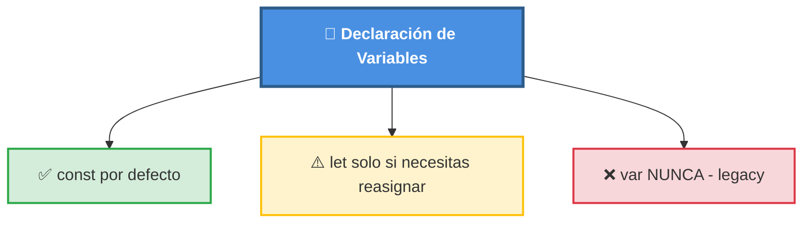
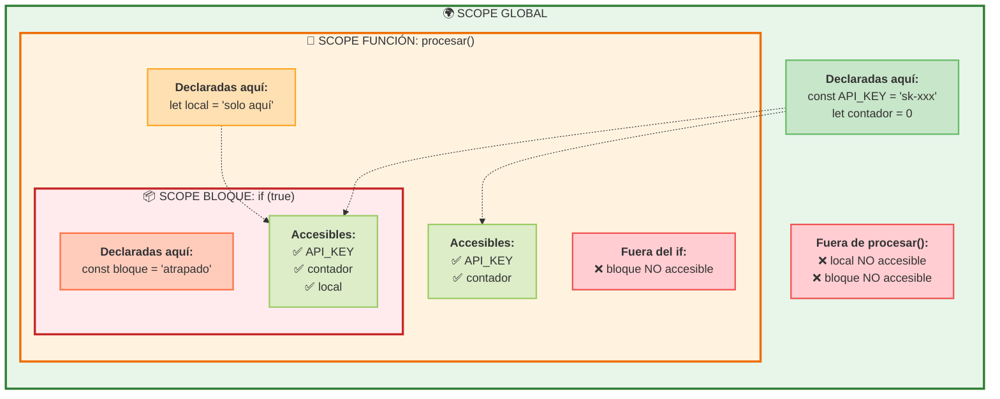

# 01 · Variables y Tipos (`let`, `const`)

> 🤔 *Si `var` ya existía, ¿por qué inventaron `let` y `const`? ¿Qué problema resuelven?*

**Respuesta**: `var` tiene **scope de función** (se "escapa" de bloques `if`/`for`), lo que causa bugs sutiles. `let` y `const` tienen **scope de bloque**, más predecible y seguro.

---

## 💡 Regla de Oro



---

## Declaración y Scope

```javascript
// const: valor NO reasignable (inmutable la referencia)
const API_KEY = 'sk-abc123';     // Secreto fijo
const MAX_TOKENS = 4096;         // Configuración

// let: valor reasignable
let intentos = 0;                // Cambiará en un bucle
intentos = 1;                    // ✅ OK

// ⚠️ const NO permite reasignar
const edad = 35;
// edad = 36;                    // ❌ TypeError
```

### Scope de Bloque vs Función

```javascript
// ❌ var: se "escapa" del bloque
if (true) {
  var fugitivo = 'visible fuera';
}
console.log(fugitivo);  // 'visible fuera' 😱

// ✅ let/const: atrapado en el bloque
if (true) {
  let atrapado = 'solo aquí dentro';
  const tambien = 'yo también';
}
// console.log(atrapado);  // ❌ ReferenceError
```

---

## 📊 Diagrama: Scope Visual



---

## Temporal Dead Zone (TDZ)

> 🤔 *¿Qué pasa si usas una variable ANTES de declararla con `let`?*

```javascript
// ❌ Temporal Dead Zone
console.log(x);        // ReferenceError: Cannot access 'x' before initialization
let x = 5;

// ✅ Correcto
let y;
console.log(y);        // undefined (declarada pero sin valor)
y = 10;
```

`let` y `const` se "izan" (hoisting) pero NO se inicializan. La zona entre el inicio del bloque y la declaración es la **Temporal Dead Zone**.

---

## `const` con Objetos y Arrays

> ⚠️ **Trampa común**: `const` impide **reasignar**, pero NO impide **mutar** el contenido.

```javascript
const config = { host: 'localhost', port: 3000 };

// ✅ Mutar propiedades: OK
config.port = 8080;
console.log(config);  // { host: 'localhost', port: 8080 }

// ❌ Reasignar: ERROR
// config = { host: 'prod', port: 443 };  // TypeError

const lista = [1, 2, 3];
lista.push(4);         // ✅ OK: [1, 2, 3, 4]
// lista = [5, 6];     // ❌ TypeError
```

---

## 🔗 Caso Real: API Keys y Configuración

```javascript
// Configuración de app Next.js + IA
const OPENAI_API_KEY = process.env.OPENAI_API_KEY;
const MODEL = 'gpt-4o-mini';
const MAX_RETRIES = 3;

let tokensUsados = 0;
let ultimaRespuesta = null;

async function preguntarIA(prompt) {
  tokensUsados += prompt.length;
  // ...
}
```

---

## 🛠️ Ejercicio

Predice la salida **antes** de ejecutar:

```javascript
const a = 10;
let b = 20;

if (true) {
  const a = 99;     // ¿Sombrea al a exterior?
  b = 30;           // ¿Modifica al b exterior?
  console.log(a);   // ¿?
}

console.log(a);      // ¿?
console.log(b);      // ¿?
```

<details>
<summary>🔍 Ver respuesta</summary>

```
99   ← const a = 99 es un NUEVO a (scope de bloque)
10   ← el a original NO fue modificado
30   ← b fue reasignado (let permite esto)
```
</details>

---

[⬅️ Volver al módulo](README.md) · [Siguiente: Funciones y Arrow Functions ➡️](02-funciones-y-arrow.md)
