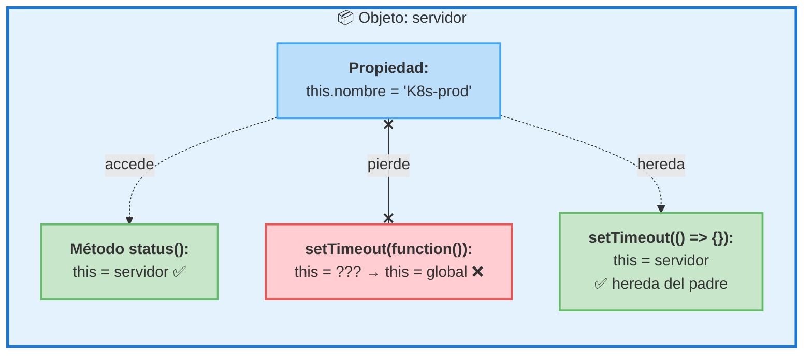
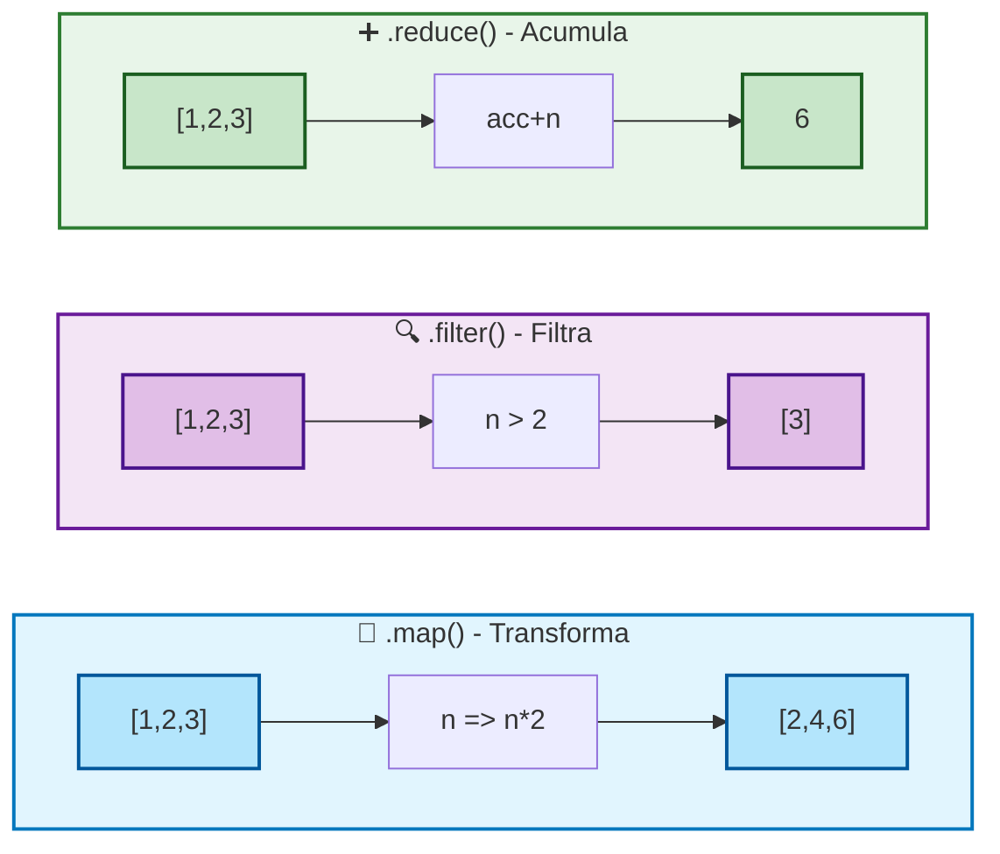

# 02 · Funciones y Arrow Functions

> 🤔 *Si `function sumar(a, b) { return a + b; }` ya funciona, ¿por qué necesitas `const sumar = (a, b) => a + b`?*

**Respuesta**: Las arrow functions son más concisas y, crucialmente, **no crean su propio `this`**. Esto evita bugs clásicos en callbacks y es la razón por la que React/Next.js las usa en todas partes.

---

## 💡 Sintaxis Comparada

```javascript
// ES5: function declaration
function sumar(a, b) {
  return a + b;
}

// ES6: arrow function (expresión)
const sumar = (a, b) => a + b;

// Un parámetro: sin paréntesis
const doble = n => n * 2;

// Sin parámetros: paréntesis vacíos
const saludo = () => 'Hola';

// Cuerpo multilínea: llaves + return explícito
const saludar = nombre => {
  const msg = `Hola, ${nombre}`;
  console.log(msg);
  return msg;
};
```

---

## 📊 Diagrama: Anatomía de una Arrow Function

```
 const sumar = (a, b) => a + b;
 ─────         ─────    ──────
   │             │         │
   │             │         └── Cuerpo (return implícito)
   │             │
   │             └── Parámetros
   │
   └── Nombre (almacenada en constante)


 const procesar = (data) => {
   const resultado = data.map(x => x * 2);
   return resultado;
 };
 ─── return explícito cuando hay llaves {} ───
```

---

## El Problema de `this`

> 🤔 *¿Por qué `this` es "diferente" dentro de una función clásica vs una arrow?*

```javascript
const servidor = {
  nombre: 'K8s-prod',
  
  // ✅ Método: this = servidor
  status() {
    console.log(`${this.nombre} activo`);  // K8s-prod activo
  },

  // ❌ Callback clásico: this se pierde
  monitorearClasico() {
    setTimeout(function() {
      console.log(this.nombre);  // undefined 😱
    }, 100);
  },

  // ✅ Arrow callback: this se preserva
  monitorearArrow() {
    setTimeout(() => {
      console.log(this.nombre);  // K8s-prod ✅
    }, 100);
  }
};
```

### Diagrama de `this`



---

## 🔗 Uso en React/Next.js

```javascript
// Componente React: handlers con arrow functions
export default function ChatIA() {
  const [mensaje, setMensaje] = useState('');

  // ✅ Arrow: this no importa en componentes funcionales
  const handleSubmit = async (e) => {
    e.preventDefault();
    const respuesta = await fetch('/api/chat', {
      method: 'POST',
      body: JSON.stringify({ mensaje })
    });
    const data = await respuesta.json();
    setMensaje(data.reply);
  };

  // ✅ Arrow en map
  const items = ['K8s', 'Docker', 'Ansible'].map(tool => (
    <li key={tool}>{tool}</li>
  ));
}
```

---

## Funciones como Parámetros (Callbacks)

```javascript
// Array.map — transforma cada elemento
const numeros = [1, 2, 3, 4];
const dobles = numeros.map(n => n * 2);        // [2, 4, 6, 8]

// Array.filter — filtra elementos
const grandes = numeros.filter(n => n > 2);     // [3, 4]

// Array.reduce — acumula en un valor
const suma = numeros.reduce((acc, n) => acc + n, 0);  // 10
```



---

## ⚠️ Cuándo NO Usar Arrow Functions

| Situación | ¿Arrow? | ¿Por qué? |
|-----------|---------|-----------|
| Métodos de objeto | ❌ | `this` no apunta al objeto |
| Constructores | ❌ | No tienen `prototype` |
| Event handlers DOM (vanilla) | ⚠️ | Depende si necesitas `this` del elemento |
| Callbacks React | ✅ | Siempre |
| `.map()`, `.filter()` | ✅ | Siempre |

---

## 🛠️ Ejercicio

Reescribe estas funciones ES5 como arrow functions:

```javascript
// 1. Convertir
function cuadrado(x) {
  return x * x;
}

// 2. Convertir
function saludo(nombre, apellido) {
  return 'Hola ' + nombre + ' ' + apellido;
}

// 3. Convertir (con template literal)
function log(nivel, mensaje) {
  console.log('[' + nivel + '] ' + mensaje);
}
```

<details>
<summary>🔍 Ver respuesta</summary>

```javascript
const cuadrado = x => x * x;
const saludo = (nombre, apellido) => `Hola ${nombre} ${apellido}`;
const log = (nivel, mensaje) => console.log(`[${nivel}] ${mensaje}`);
```
</details>

---

[⬅️ Volver al módulo](README.md) · [Siguiente: Template Literals ➡️](03-template-literals.md)
