# 04 · Desestructuración y Spread/Rest

> 🤔 *Cuando una API de IA devuelve un JSON con 20 campos, ¿necesitas acceder a `respuesta.data.choices[0].message.content` cada vez? ¿No hay forma más limpia?*

---

## 💡 Desestructuración de Objetos

Extrae propiedades de un objeto y créalas como variables locales **en una sola línea**.

```javascript
const usuario = { nombre: 'Ana', edad: 28, rol: 'SRE' };

// ❌ Sin desestructuración
const nombre = usuario.nombre;
const edad = usuario.edad;

// ✅ Con desestructuración
const { nombre, edad, rol } = usuario;
console.log(nombre);  // Ana
console.log(rol);     // SRE
```

### Renombrar y Valores por Defecto

```javascript
const config = { host: 'localhost', port: 3000 };

// Renombrar + valor por defecto
const { host: servidor, port: puerto, ssl = false } = config;

console.log(servidor);  // localhost
console.log(ssl);       // false (default)
```

### Desestructuración Anidada

```javascript
const respuestaIA = {
  data: {
    choices: [{ message: { content: 'Hola desde GPT' } }]
  }
};

// ✅ Acceso directo al contenido
const { data: { choices: [{ message: { content } }] } } = respuestaIA;
console.log(content);  // Hola desde GPT
```

---

## 💡 Desestructuración de Arrays

```javascript
const [primero, segundo, ...resto] = [1, 2, 3, 4, 5];
console.log(primero);  // 1
console.log(segundo);  // 2
console.log(resto);    // [3, 4, 5]

// Saltar elementos
const [, , tercero] = ['a', 'b', 'c'];
console.log(tercero);  // c

// Swap elegante
let a = 1, b = 2;
[a, b] = [b, a];
console.log(a, b);  // 2 1
```

---

## 💡 Operador Spread (`...`)

**Expande** un array u objeto en sus elementos individuales.

```javascript
// Arrays
const frontend = ['React', 'Next.js'];
const backend = ['Node', 'Express'];
const fullstack = [...frontend, ...backend, 'PostgreSQL'];
// ['React', 'Next.js', 'Node', 'Express', 'PostgreSQL']

// Objetos (merge)
const baseConfig = { host: 'localhost', port: 3000 };
const prodConfig = { ...baseConfig, port: 443, ssl: true };
// { host: 'localhost', port: 443, ssl: true }
// ↑ port se sobrescribe
```

---

## 💡 Operador Rest (`...` en parámetros)

**Captura** el resto de los argumentos en un array.

```javascript
const suma = (a, b, ...numeros) => {
  return numeros.reduce((acc, n) => acc + n, a + b);
};

console.log(suma(1, 2, 3, 4, 5));  // 15
//               a  b  ───rest───
```

---

## 📊 Diagrama: Spread vs Rest

```mermaid
flowchart TB
    Spread["⚡ SPREAD - Expande"]
    S1["const arr = [1, 2, 3]<br/>...arr<br/>→ 1 2 3 (expandido)"]
    S2["const obj = {a: 1}<br/>{...obj, b: 2}<br/>→ merge: {a:1, b:2}"]
    S3["<b>DIRECCIÓN: Estructura → Elementos</b>"]
    
    Rest["📦 REST - Recolecta"]
    R1["[1, 2, 3, 4]<br/>[primero, ...resto]<br/>→ primero=1, resto=[2,3,4]"]
    R2["fn(a, ...args)<br/>args captura el resto<br/>→ array con args"]
    R3["<b>DIRECCIÓN: Elementos → Estructura</b>"]
    
    Spread --> S1 --> S2 --> S3
    Rest --> R1 --> R2 --> R3
    
    style Spread fill:#1976d2,color:#fff,stroke:#0d47a1,stroke-width:3px
    style Rest fill:#f57c00,color:#fff,stroke:#e65100,stroke-width:3px
    
    style S1 fill:#bbdefb,stroke:#1565c0,stroke-width:2px
    style S2 fill:#bbdefb,stroke:#1565c0,stroke-width:2px
    style S3 fill:#e3f2fd,stroke:#1976d2,stroke-width:2px
    
    style R1 fill:#ffe0b2,stroke:#e65100,stroke-width:2px
    style R2 fill:#ffe0b2,stroke:#e65100,stroke-width:2px
    style R3 fill:#fff3e0,stroke:#f57c00,stroke-width:2px
```



---

## 🔗 Caso Real: Props de React

```javascript
// Componente que recibe muchas props
function BotonIA({ texto, onClick, disabled, ...estilos }) {
  return (
    <button
      onClick={onClick}
      disabled={disabled}
      style={estilos}          // rest de las props como estilo
    >
      {texto}
    </button>
  );
}

// Uso
<BotonIA
  texto="Preguntar"
  onClick={handleClick}
  disabled={false}
  color="blue"                // → va a ...estilos
  fontSize="16px"             // → va a ...estilos
/>
```

---

## 🔗 Caso Real: Merge de Estado

```javascript
// Actualizar estado parcialmente (patrón muy común en React)
const [config, setConfig] = useState({
  modelo: 'gpt-4o-mini',
  temperatura: 0.7,
  maxTokens: 1000
});

// Solo cambia temperatura, el resto se mantiene
setConfig(prev => ({ ...prev, temperatura: 0.9 }));
// { modelo: 'gpt-4o-mini', temperatura: 0.9, maxTokens: 1000 }
```

---

## 🛠️ Ejercicio

```javascript
const respuestaAPI = {
  status: 200,
  data: {
    model: 'gpt-4o-mini',
    choices: [
      { index: 0, message: { role: 'assistant', content: 'Hola!' } },
      { index: 1, message: { role: 'assistant', content: 'Adiós!' } }
    ],
    usage: { prompt_tokens: 10, completion_tokens: 20 }
  }
};

// 1. Extrae 'status' y 'data' con desestructuración
// 2. Extrae solo la primera choice
// 3. Extrae prompt_tokens y completion_tokens
// 4. Combina usage con { total_tokens: prompt + completion }
```

<details>
<summary>🔍 Ver respuesta</summary>

```javascript
const { status, data } = respuestaAPI;
const { choices: [primeraChoice] } = data;
const { usage: { prompt_tokens, completion_tokens } } = data;
const usageCompleto = { ...data.usage, total_tokens: prompt_tokens + completion_tokens };

console.log(primeraChoice.message.content);  // Hola!
console.log(usageCompleto);  // { prompt_tokens: 10, completion_tokens: 20, total_tokens: 30 }
```
</details>

---

[⬅️ Volver al módulo](README.md) · [Siguiente: Clases Básicas ➡️](05-clases-basicas.md)
