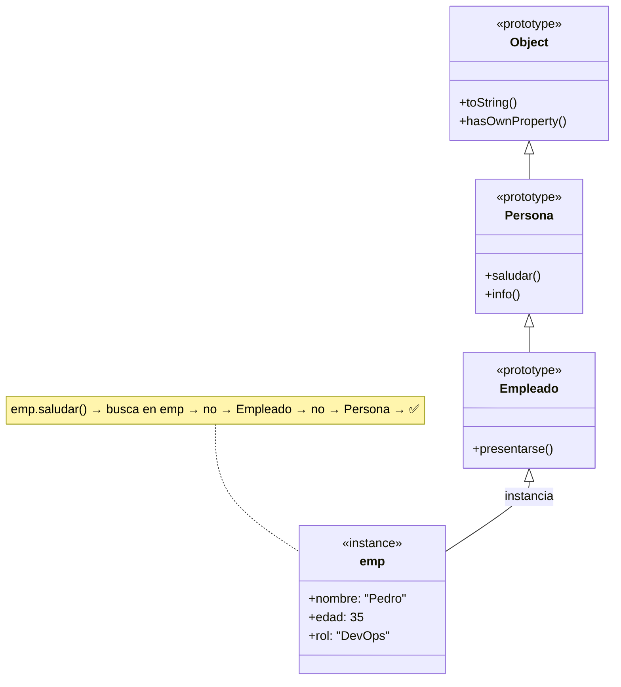

# 05 · Clases Básicas

> 🤔 *Si JavaScript es un lenguaje basado en prototipos, ¿por qué añadieron `class`? ¿Es lo mismo que en Java o Python?*

**Respuesta**: `class` es **azúcar sintáctica** sobre el sistema de prototipos. Por debajo sigue siendo prototipos, pero la sintaxis es más familiar si vienes de otros lenguajes. React las usaba antes; ahora usa funciones, pero las verás en librerías.

---

## Sintaxis Básica

```javascript
class Persona {
  constructor(nombre, edad) {
    this.nombre = nombre;
    this.edad = edad;
  }

  saludar() {
    return `Hola, soy ${this.nombre}`;
  }

  info() {
    return `${this.nombre}, ${this.edad} años`;
  }
}

const juan = new Persona('Juan', 35);
console.log(juan.saludar());  // Hola, soy Juan
console.log(juan.info());     // Juan, 35 años
```

---

## Herencia con `extends`

```javascript
class Empleado extends Persona {
  constructor(nombre, edad, rol) {
    super(nombre, edad);    // Llama al constructor padre
    this.rol = rol;
  }

  presentarse() {
    return `${this.saludar()}, soy ${this.rol}`;
  }
}

const emp = new Empleado('Pedro', 35, 'DevOps');
console.log(emp.presentarse());  // Hola, soy Pedro, soy DevOps
console.log(emp.info());         // Pedro, 35 años (heredado)
```

---

## 📊 Diagrama: Cadena de Herencia



---

## Métodos Estáticos y Getters

```javascript
class ConfigIA {
  #apiKey;  // Campo privado (ES2022)

  constructor(apiKey, modelo = 'gpt-4o-mini') {
    this.#apiKey = apiKey;
    this.modelo = modelo;
  }

  // Getter: accede como propiedad
  get resumen() {
    return `Modelo: ${this.modelo}, Key: ${this.#apiKey.slice(0, 8)}...`;
  }

  // Método estático: no necesita instancia
  static modelos() {
    return ['gpt-4o-mini', 'gpt-4o', 'gpt-4-turbo'];
  }
}

const config = new ConfigIA('sk-abc123xyz');
console.log(config.resumen);               // Modelo: gpt-4o-mini, Key: sk-abc12...
console.log(ConfigIA.modelos());           // ['gpt-4o-mini', ...]
// console.log(config.#apiKey);            // ❌ SyntaxError (privado)
```

---

## ⚠️ Clases vs Funciones en React Moderno

```
┌─────────────────────────────────────────────┐
│  React ANTES (Class Components):            │
│  class MiComp extends React.Component {     │
│    render() { return <div /> }              │
│  }                                          │
│                                             │
│  React AHORA (Function Components):         │
│  function MiComp() {                        │
│    return <div />;                          │
│  }                                          │
│                                             │
│  ✅ Usa FUNCIONES para React.               │
│  ✅ Usa CLASES para modelos de datos o      │
│     librerías que lo requieran.             │
└─────────────────────────────────────────────┘
```

---

## 🛠️ Ejercicio

Crea una clase `Servidor` con:
- Propiedades: `nombre`, `ip`, `estado` (default: `'activo'`)
- Método: `ping()` → retorna `"Servidor {nombre} ({ip}): {estado}"`
- Clase hija `ServidorK8s` con propiedad extra `pods` (número)
- Método: `resumen()` → retorna `"{nombre} tiene {pods} pods"`

<details>
<summary>🔍 Ver respuesta</summary>

```javascript
class Servidor {
  constructor(nombre, ip, estado = 'activo') {
    this.nombre = nombre;
    this.ip = ip;
    this.estado = estado;
  }
  ping() {
    return `Servidor ${this.nombre} (${this.ip}): ${this.estado}`;
  }
}

class ServidorK8s extends Servidor {
  constructor(nombre, ip, pods, estado) {
    super(nombre, ip, estado);
    this.pods = pods;
  }
  resumen() {
    return `${this.nombre} tiene ${this.pods} pods`;
  }
}

const k8s = new ServidorK8s('prod-cluster', '10.0.0.1', 12);
console.log(k8s.ping());     // Servidor prod-cluster (10.0.0.1): activo
console.log(k8s.resumen());  // prod-cluster tiene 12 pods
```
</details>

---

[⬅️ Volver al módulo](README.md) · [Siguiente módulo: JS Avanzado ➡️](../03-javascript-avanzado/README.md)
