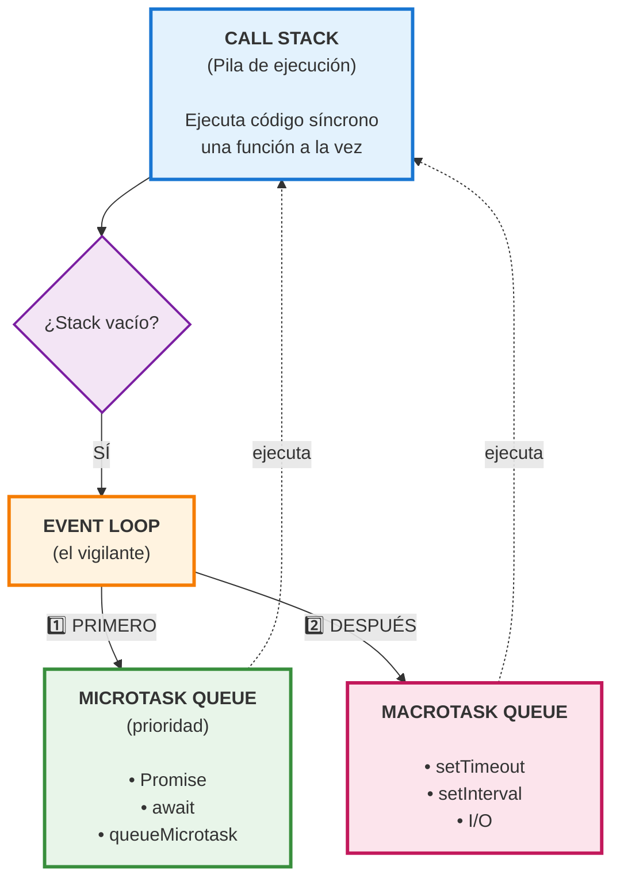
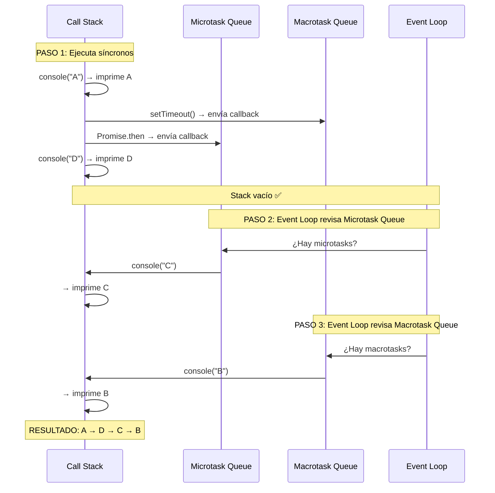
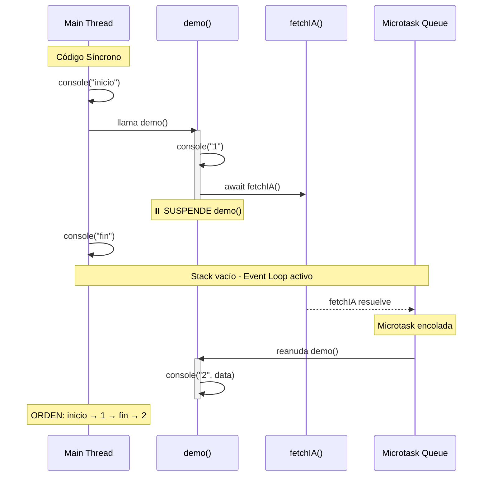

# 01 · Event Loop — El Corazón de JavaScript

> 🤔 *¿Qué pasa si ejecutamos esto? Predice el orden ANTES de leer la respuesta:*
> ```javascript
> console.log("1");
> setTimeout(() => console.log("2"), 0);
> console.log("3");
> ```

**Resultado**: `1`, `3`, `2` — ¿Por qué `2` va al final si el timeout es **0 milisegundos**?

---

## 💡 JavaScript es Single-Threaded

JavaScript tiene **un solo hilo** de ejecución. No puede hacer dos cosas "a la vez" como Java con múltiples threads. Entonces, ¿cómo maneja operaciones asíncronas como `fetch` o `setTimeout`?

**Con el Event Loop**: un mecanismo que coordina la ejecución entre el código síncrono y las operaciones asíncronas.

---

## 📊 Diagrama del Event Loop



### Regla de Prioridad

```
1️⃣  Código SÍNCRONO       (Call Stack)
2️⃣  MICROTASKS            (Promises, await)
3️⃣  MACROTASKS            (setTimeout, setInterval)
```

---

## Ejemplo Paso a Paso

```javascript
console.log("A");                           // 1. Síncrono

setTimeout(() => console.log("B"), 0);      // 2. → Macrotask queue

Promise.resolve().then(() => console.log("C")); // 3. → Microtask queue

console.log("D");                           // 4. Síncrono
```

### Ejecución Visual



---

## Ejemplo con `async/await`

```javascript
async function demo() {
  console.log("1");                    // Síncrono
  const data = await fetchIA();        // Pausa aquí (microtask)
  console.log("2", data);             // Después del await
  return data;
}

console.log("inicio");
demo();
console.log("fin");
```



---

## 🔗 ¿Por Qué Importa en React/Next.js?

```javascript
// En un componente React
useEffect(() => {
  // Este callback es ASÍNCRONO (como un macrotask)
  // Se ejecuta DESPUÉS del render
  fetchDatos().then(setDatos);
}, []);

// El componente renderiza PRIMERO (síncrono)
// useEffect ejecuta DESPUÉS (Event Loop)
```

```
FLUJO REACT:
1. Render síncrono → genera JSX → DOM
2. Paint del navegador (visual)
3. useEffect callback → Event Loop → fetch → setState
4. Re-render con datos nuevos
```

---

## 🛠️ Ejercicio

Predice el orden de salida:

```javascript
console.log('A');

setTimeout(() => {
  console.log('B');
  Promise.resolve().then(() => console.log('C'));
}, 0);

Promise.resolve().then(() => {
  console.log('D');
  setTimeout(() => console.log('E'), 0);
});

console.log('F');
```

<details>
<summary>🔍 Ver respuesta</summary>

```
A → F → D → B → C → E

Detalle:
A  - síncrono
F  - síncrono
D  - microtask (primera Promise)
B  - macrotask (primer setTimeout)
C  - microtask (Promise dentro del setTimeout de B)
E  - macrotask (setTimeout programado dentro de la Promise de D)
```
</details>

---

[⬅️ Volver al módulo](README.md) · [Siguiente: Async/Await y Promises ➡️](02-async-await-promises.md)
