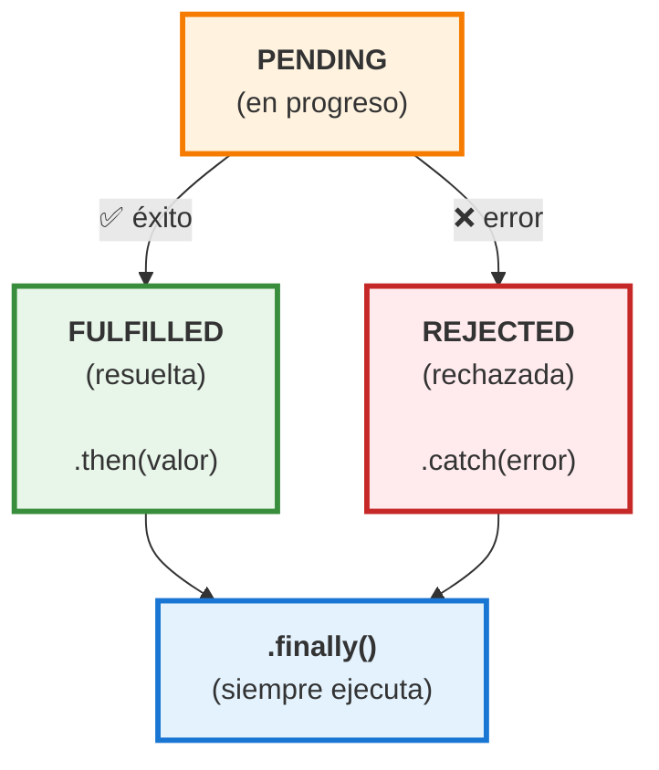

# 02 · Async/Await y Promises

> 🤔 *Si JavaScript solo tiene un hilo, ¿cómo hace `fetch` para no bloquear toda la página mientras espera la respuesta de una API de IA?*

**Respuesta**: Las Promises delegan la espera al runtime (libuv en Node.js, Web APIs en el navegador) y el Event Loop devuelve el resultado cuando está listo.

---

## 💡 Promise: La Base

Una Promise es un **objeto que representa un valor futuro**: puede resolverse (éxito) o rechazarse (error).

```javascript
// Crear una Promise
const promesa = new Promise((resolve, reject) => {
  const exito = true;
  
  if (exito) {
    resolve('✅ Datos obtenidos');    // Éxito
  } else {
    reject('❌ Error de conexión');    // Fallo
  }
});

// Consumir con .then / .catch
promesa
  .then(resultado => console.log(resultado))   // ✅ Datos obtenidos
  .catch(error => console.error(error));
```

### Diagrama de Estados



---

## 💡 Async/Await: Sintaxis Limpia

`async/await` es **azúcar sintáctica** sobre Promises. Hace que el código asíncrono se lea como síncrono.

```javascript
// ❌ Con Promises (callback hell potencial)
function obtenerDatos() {
  return fetch('/api/datos')
    .then(res => res.json())
    .then(data => {
      return fetch(`/api/detalles/${data.id}`);
    })
    .then(res => res.json())
    .catch(err => console.error(err));
}

// ✅ Con async/await (lineal, legible)
async function obtenerDatos() {
  try {
    const res1 = await fetch('/api/datos');
    const data = await res1.json();
    
    const res2 = await fetch(`/api/detalles/${data.id}`);
    const detalles = await res2.json();
    
    return detalles;
  } catch (error) {
    console.error('Error:', error);
  }
}
```

---

## 📊 Diagrama: Flujo de async/await

```
async function fetchIA(prompt) {
  console.log('1. Inicio');                     ── SÍNCRONO
  
  const res = await fetch('/api/chat');         ── SUSPENDE aquí
                                                   │
  console.log('2. Respuesta recibida');         ── REANUDA después
  const data = await res.json();                ── SUSPENDE otra vez
                                                   │
  console.log('3. Datos parseados');            ── REANUDA
  return data;
}

LÍNEA TEMPORAL:
──────────────────────────────────────────────►
│ 1.Inicio │  ...esperando...  │ 2.Respuesta │ 3.Datos │
│ SÍNCRONO │  CÓDIGO LIBRE     │  REANUDA    │ REANUDA │
│          │  (otros eventos)  │             │         │
```

---

## Manejo de Errores

```javascript
// ✅ Patrón recomendado: try/catch
async function llamarIA(prompt) {
  try {
    const respuesta = await fetch('https://api.openai.com/v1/chat/completions', {
      method: 'POST',
      headers: {
        'Content-Type': 'application/json',
        'Authorization': `Bearer ${process.env.OPENAI_API_KEY}`
      },
      body: JSON.stringify({
        model: 'gpt-4o-mini',
        messages: [{ role: 'user', content: prompt }]
      })
    });

    if (!respuesta.ok) {
      throw new Error(`HTTP ${respuesta.status}: ${respuesta.statusText}`);
    }

    const data = await respuesta.json();
    return data.choices[0].message.content;

  } catch (error) {
    console.error('❌ Error IA:', error.message);
    return null;  // o lanza el error según tu lógica
  }
}
```

---

## Ejecución Paralela vs Secuencial

```javascript
// ❌ SECUENCIAL: 3 segundos total (1+1+1)
async function secuencial() {
  const a = await fetch('/api/1');  // 1s
  const b = await fetch('/api/2');  // 1s (espera a que termine a)
  const c = await fetch('/api/3');  // 1s (espera a que termine b)
}

// ✅ PARALELO: 1 segundo total (simultáneo)
async function paralelo() {
  const [a, b, c] = await Promise.all([
    fetch('/api/1'),
    fetch('/api/2'),
    fetch('/api/3')
  ]);
}
```

### Diagrama

```
SECUENCIAL:
──▶ fetch /1 ──▶ fetch /2 ──▶ fetch /3 ──▶ 
|── 1s ──|── 1s ──|── 1s ──|
Total: 3 segundos

PARALELO (Promise.all):
──▶ fetch /1 ──▶
──▶ fetch /2 ──▶  (simultáneo)
──▶ fetch /3 ──▶
|──── 1s ────|
Total: 1 segundo
```

---

## 🔗 Caso Real: Fetch a API de IA

```javascript
async function chatIA(mensaje) {
  const respuesta = await fetch('/api/chat', {
    method: 'POST',
    headers: { 'Content-Type': 'application/json' },
    body: JSON.stringify({ mensaje })
  });
  
  const data = await respuesta.json();
  return data;
}

// Uso
const resultado = await chatIA('Explica Kubernetes en 2 líneas');
console.log(resultado);
```

---

## 🛠️ Ejercicio

Escribe una función `fetchConTimeout` que haga un fetch pero cancele si tarda más de 5 segundos:

<details>
<summary>🔍 Ver respuesta</summary>

```javascript
async function fetchConTimeout(url, ms = 5000) {
  const controller = new AbortController();
  const timeout = setTimeout(() => controller.abort(), ms);

  try {
    const res = await fetch(url, { signal: controller.signal });
    clearTimeout(timeout);
    return await res.json();
  } catch (error) {
    if (error.name === 'AbortError') {
      throw new Error(`Timeout: ${url} tardó más de ${ms}ms`);
    }
    throw error;
  }
}
```
</details>

---

[⬅️ Volver al módulo](README.md) · [Siguiente: Closures ➡️](03-closures.md)
