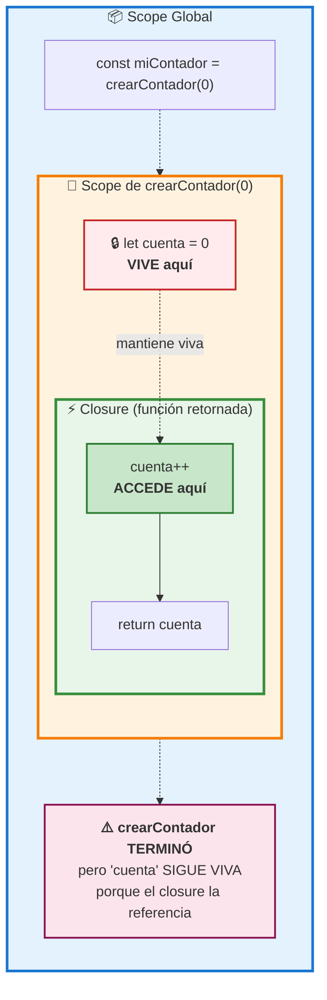
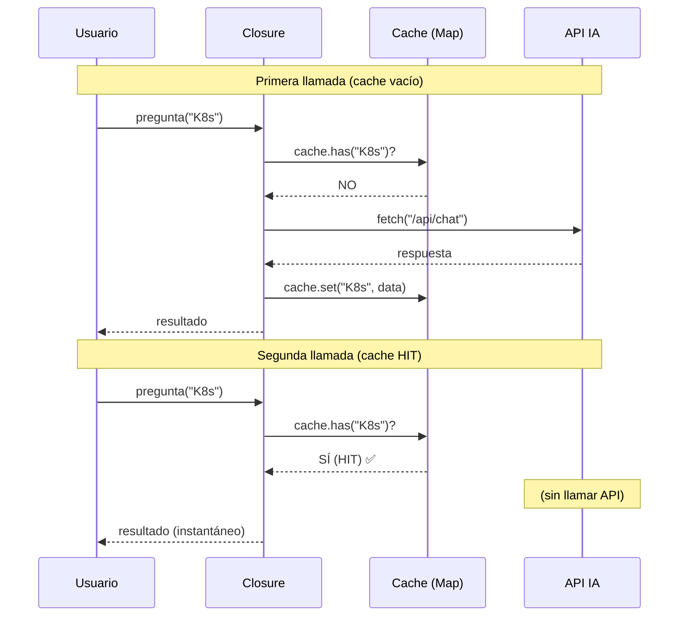

# 03 · Closures — Funciones que "Recuerdan"

> 🤔 *¿Cómo puede una función acceder a variables de otra función que ya terminó de ejecutarse? ¿No debería haberse destruido ese dato?*

**Respuesta**: No. Una closure "atrapa" las variables de su entorno léxico. Mientras la closure exista, esas variables viven.

---

## 💡 ¿Qué es un Closure?

Un closure es una función que **recuerda las variables del scope donde fue creada**, incluso después de que ese scope haya terminado.

```javascript
function crearContador(inicial) {
  let cuenta = inicial;   // 🔒 Variable "encapsulada"

  return function() {     // ← Esta función ES el closure
    cuenta++;
    return cuenta;
  };
}

const miContador = crearContador(0);
console.log(miContador()); // 1
console.log(miContador()); // 2  ← ¡Recuerda el estado!
console.log(miContador()); // 3

const otroContador = crearContador(100);
console.log(otroContador()); // 101  ← Independiente
```

---

## 📊 Diagrama: Scope Chain del Closure



---

## Patrón: Encapsulación (datos privados)

```javascript
function Banco() {
  let saldo = 1000;  // 🔒 Privado — inaccesible desde fuera

  return {
    depositar: (monto) => { saldo += monto; return saldo; },
    retirar:   (monto) => { saldo -= monto; return saldo; },
    consultar: ()      => saldo
  };
}

const miCuenta = Banco();
console.log(miCuenta.consultar());  // 1000
console.log(miCuenta.depositar(500)); // 1500
console.log(miCuenta.retirar(200));   // 1300

// ❌ No puedes acceder a 'saldo' directamente
// console.log(miCuenta.saldo);  // undefined
```

---

## 🔗 Caso Real: Cache de Prompts IA

```javascript
function crearCacheIA(maxSize = 5) {
  const cache = new Map();  // 🔒 Closure mantiene cache vivo

  return async (prompt) => {
    // Si ya lo preguntamos, devolver de cache
    if (cache.has(prompt)) {
      console.log('✅ Cache HIT');
      return cache.get(prompt);
    }

    // Si no, llamar a la IA
    console.log('🌐 Llamando a IA...');
    const respuesta = await fetch('/api/chat', {
      method: 'POST',
      body: JSON.stringify({ prompt })
    });
    const data = await respuesta.json();

    // Guardar en cache (con límite de tamaño)
    if (cache.size >= maxSize) {
      const primeraKey = cache.keys().next().value;
      cache.delete(primeraKey);
    }
    cache.set(prompt, data);
    
    return data;
  };
}

const preguntarIA = crearCacheIA(3);

await preguntarIA('¿Qué es K8s?');     // 🌐 Llamando a IA...
await preguntarIA('¿Qué es K8s?');     // ✅ Cache HIT (instantáneo)
await preguntarIA('¿Qué es Docker?');  // 🌐 Llamando a IA...
```

---

## 📊 Diagrama de Secuencia: Cache con Closure



---

## 🔗 Caso Real: Gestor de Secrets (GitHub Actions)

```javascript
function createVaultClient(vaultUrl) {
  const token = process.env.VAULT_TOKEN;  // 🔒 Encapsulado
  let requestCount = 0;

  return async function getSecret(path) {
    requestCount++;
    console.log(`🔐 Vault request #${requestCount}: ${path}`);

    const res = await fetch(`${vaultUrl}/v1/secret/data/${path}`, {
      headers: { 'X-Vault-Token': token }
    });
    
    return (await res.json()).data.data;
  };
}

const vault = createVaultClient('https://vault.empresa.com');
const dbPassword = await vault('db/credentials');
const apiKey = await vault('openai/key');
// token nunca se expone fuera de la closure
```

---

## ⚠️ Trampa Clásica: Closure en Bucles

```javascript
// ❌ Bug clásico con var
for (var i = 0; i < 3; i++) {
  setTimeout(() => console.log(i), 100);
}
// Imprime: 3, 3, 3  ← todas comparten el mismo 'i'

// ✅ Solución con let (scope de bloque)
for (let i = 0; i < 3; i++) {
  setTimeout(() => console.log(i), 100);
}
// Imprime: 0, 1, 2  ← cada iteración tiene su propio 'i'
```

---

## 🛠️ Ejercicio

Crea una función `crearRateLimiter(maxPorMinuto)` que limite las llamadas a una función:

<details>
<summary>🔍 Ver respuesta</summary>

```javascript
function crearRateLimiter(maxPorMinuto) {
  let llamadas = 0;
  let ultimoReset = Date.now();

  return function(fn) {
    const ahora = Date.now();
    
    // Reset cada minuto
    if (ahora - ultimoReset > 60000) {
      llamadas = 0;
      ultimoReset = ahora;
    }

    if (llamadas >= maxPorMinuto) {
      console.log('⚠️ Rate limit alcanzado');
      return null;
    }

    llamadas++;
    return fn();
  };
}

const limiter = crearRateLimiter(3);
limiter(() => console.log('Llamada 1'));  // ✅
limiter(() => console.log('Llamada 2'));  // ✅
limiter(() => console.log('Llamada 3'));  // ✅
limiter(() => console.log('Llamada 4'));  // ⚠️ Rate limit
```
</details>

---

[⬅️ Volver al módulo](README.md) · [Siguiente: Prototypes ➡️](04-prototypes.md)
