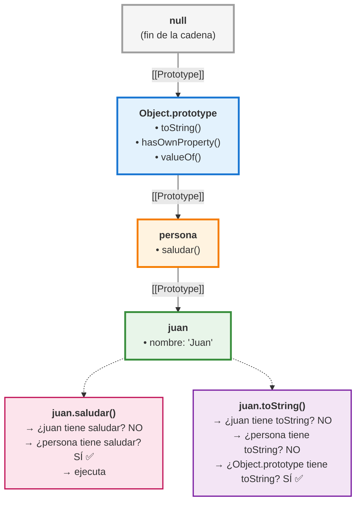

# 04 · Prototypes — La Herencia Oculta de JavaScript

> 🤔 *Cuando haces `[1,2,3].map(n => n*2)`, ¿de dónde sale el método `.map()`? Tú no lo definiste.*

**Respuesta**: De `Array.prototype`. Todo objeto en JavaScript hereda métodos de su prototipo. Es la cadena invisible que conecta todo.

---

## 💡 Concepto

Todo objeto JS tiene una propiedad interna `[[Prototype]]` que apunta a otro objeto. Cuando accedes a una propiedad que no existe en el objeto, JS la busca en la cadena de prototipos.

```javascript
const persona = {
  saludar() {
    return `Hola, soy ${this.nombre}`;
  }
};

const juan = Object.create(persona);
juan.nombre = 'Juan';

console.log(juan.saludar());   // Hola, soy Juan
console.log(juan.nombre);      // Juan (propio)
console.log(juan.toString());  // [object Object] (heredado de Object.prototype)
```

---

## 📊 Diagrama: Cadena de Prototipos



---

## Arrays y sus Prototipos

```javascript
const arr = [1, 2, 3];

// Todos estos vienen de Array.prototype:
arr.map(n => n * 2);      // Array.prototype.map
arr.filter(n => n > 1);   // Array.prototype.filter
arr.reduce((a,b) => a+b); // Array.prototype.reduce
arr.push(4);              // Array.prototype.push

// Cadena:
// arr → Array.prototype → Object.prototype → null
```

---

## `class` es Syntactic Sugar sobre Prototipos

```javascript
// Esto:
class Animal {
  constructor(nombre) { this.nombre = nombre; }
  hablar() { return `${this.nombre} hace ruido`; }
}

// Es equivalente a esto:
function Animal(nombre) {
  this.nombre = nombre;
}
Animal.prototype.hablar = function() {
  return `${this.nombre} hace ruido`;
};

// Ambos producen la misma cadena prototípica
```

---

## 🔗 ¿Por Qué Importa?

No vas a escribir código con prototipos directamente, pero necesitas **entenderlo** porque:

1. **React internals**: hooks, componentes y reconciliación usan prototipos
2. **Debug**: cuando un error dice "X is not a function", es un problema en la cadena
3. **Librerías**: muchas extienden prototipos (`Array.prototype.flat`, polyfills)

```
┌─────────────────────────────────────────────┐
│  EN LA PRÁCTICA:                             │
│                                              │
│  ✅ Usa class/extends (azúcar)               │
│  ✅ Entiende la cadena cuando debuggeas      │
│  ❌ No manipules prototipos directamente     │
│  ❌ No extiendas Object.prototype           │
└─────────────────────────────────────────────┘
```

---

## 🛠️ Ejercicio

¿Qué imprime este código y por qué?

```javascript
const base = { tipo: 'servidor' };
const dev = Object.create(base);
const prod = Object.create(base);

dev.nombre = 'dev-01';
prod.nombre = 'prod-01';

base.tipo = 'container';

console.log(dev.tipo);   // ¿?
console.log(prod.tipo);  // ¿?
console.log(dev.nombre); // ¿?
```

<details>
<summary>🔍 Ver respuesta</summary>

```
container   ← dev.tipo busca en base, que fue modificado
container   ← prod.tipo busca en la misma base
dev-01      ← nombre es propiedad PROPIA de dev

Los dos heredan de la misma 'base'. Cambiar base
afecta a todos los que heredan de ella.
```
</details>

---

[⬅️ Volver al módulo](README.md) · [Siguiente: Modules ➡️](05-modules-import-export.md)
