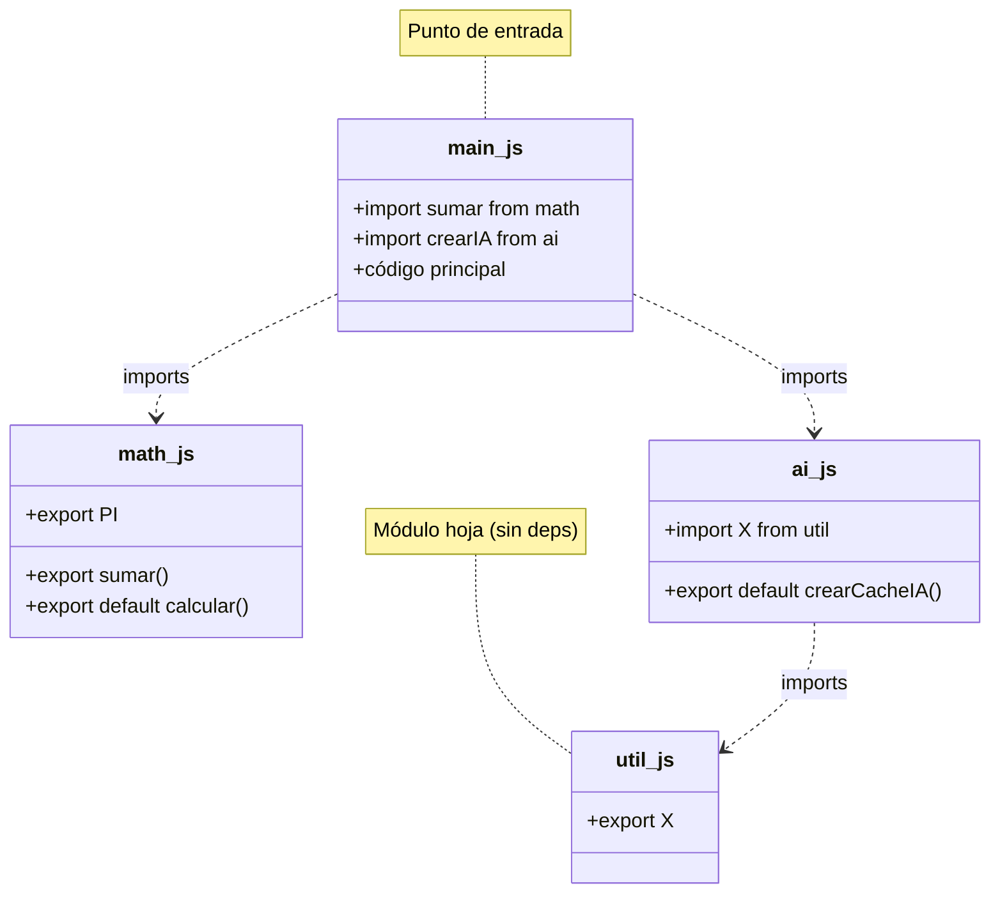
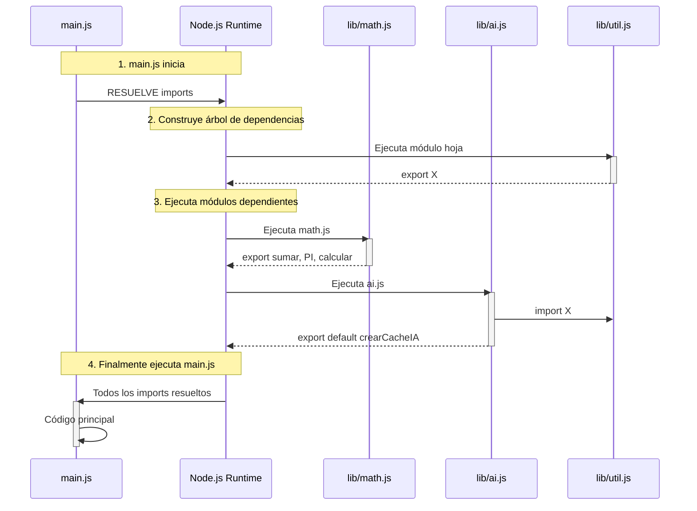

# 05 · Modules (import/export)

> 🤔 *¿Cómo organiza Next.js un proyecto con 50 archivos sin que todo sea un caos global? ¿Qué reemplazó al viejo `require()`?*

**Respuesta**: ES Modules (`import`/`export`) — el sistema oficial de módulos de JavaScript. Cada archivo es un módulo con su propio scope.

---

## 💡 Export: Hacer Visible

```javascript
// 📁 lib/math.js

// Named exports (múltiples por archivo)
export const PI = 3.14159;
export const sumar = (a, b) => a + b;
export const restar = (a, b) => a - b;

// Default export (uno por archivo)
export default function calcular(op, a, b) {
  const operaciones = { sumar, restar };
  return operaciones[op](a, b);
}
```

## 💡 Import: Consumir

```javascript
// 📁 main.js

// Import default + named
import calcular, { PI, sumar } from './lib/math.js';

console.log(sumar(5, 3));          // 8
console.log(PI);                    // 3.14159
console.log(calcular('sumar', 2, 3)); // 5

// Import con renombrado
import { sumar as sum, restar as sub } from './lib/math.js';

// Import todo como namespace
import * as Matematica from './lib/math.js';
console.log(Matematica.PI);       // 3.14159
```

---

## 📊 Diagrama: Flujo de Imports

### Estructura de Dependencias



### Orden de Ejecución



---

## CommonJS vs ES Modules

| Aspecto | `require()` (CommonJS) | `import` (ES Modules) |
|---------|----------------------|----------------------|
| Estándar | Node.js original | ECMAScript oficial |
| Carga | Dinámica (runtime) | Estática (build time) |
| Tree-shaking | ❌ No | ✅ Sí (optimización) |
| Top-level await | ❌ No | ✅ Sí |
| Next.js | ⚠️ Solo en config | ✅ En todo el código |

```javascript
// ❌ CommonJS (legacy, evitar en Next.js)
const express = require('express');
module.exports = app;

// ✅ ES Modules (moderno, usar siempre)
import express from 'express';
export default app;
```

> 💡 Para usar ES Modules en Node.js puro, añade `"type": "module"` en tu `package.json`. Next.js lo soporta por defecto.

---

## 🔗 Estructura Real en Next.js

```
src/
├── app/
│   ├── page.tsx          ← import desde lib/ y components/
│   └── chat/
│       └── page.tsx      ← import desde lib/ai.ts
├── lib/
│   ├── math.ts           ← export const sumarTokens
│   └── ai.ts             ← export default crearCacheIA
└── components/
    └── BotonIA.tsx        ← export default function BotonIA

// En page.tsx:
import { sumarTokens } from '@/lib/math';     // @ = alias a src/
import crearCacheIA from '@/lib/ai';
import BotonIA from '@/components/BotonIA';
```

---

## Import Dinámico

```javascript
// Carga módulos bajo demanda (útil para reducir bundle)
const modulo = await import('./pesado.js');
modulo.funcionPesada();

// En Next.js: lazy loading de componentes
import dynamic from 'next/dynamic';
const GraficoComplejo = dynamic(() => import('@/components/Grafico'));
```

---

## 🛠️ Ejercicio

Crea 3 archivos y haz que funcionen con imports:

```
ejercicio/
├── config.js    → exporta API_URL y MAX_RETRIES (named)
├── api.js       → importa de config, exporta default fetchDatos()
└── main.js      → importa todo y ejecuta
```

<details>
<summary>🔍 Ver respuesta</summary>

```javascript
// config.js
export const API_URL = 'https://api.example.com';
export const MAX_RETRIES = 3;

// api.js
import { API_URL, MAX_RETRIES } from './config.js';

export default async function fetchDatos(endpoint) {
  for (let i = 0; i < MAX_RETRIES; i++) {
    try {
      const res = await fetch(`${API_URL}/${endpoint}`);
      return await res.json();
    } catch (e) {
      console.log(`Intento ${i + 1}/${MAX_RETRIES} fallido`);
    }
  }
  throw new Error('Todos los intentos fallaron');
}

// main.js
import fetchDatos from './api.js';
const data = await fetchDatos('users');
console.log(data);
```
</details>

---

[⬅️ Volver al módulo](README.md) · [Siguiente: JSON y Fetch API ➡️](06-json-y-fetch.md)
