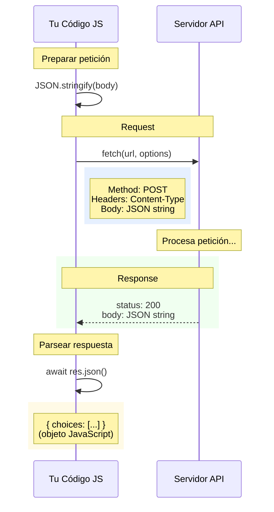

# 06 · JSON y Fetch API

> 🤔 *¿Por qué TODAS las APIs de IA (OpenAI, Anthropic, Ollama) usan JSON? ¿Y cómo habla JavaScript con ellas?*

**Respuesta**: JSON (JavaScript Object Notation) es el formato universal de intercambio de datos web. Y `fetch` es la API nativa de JavaScript para hacer peticiones HTTP.

---

## 💡 JSON: Serialización de Datos

```javascript
// Objeto JavaScript → String JSON
const promptIA = {
  model: "gpt-4o-mini",
  messages: [
    { role: "system", content: "Eres un experto DevOps" },
    { role: "user", content: "Explica Next.js en español" }
  ],
  temperature: 0.7
};

const jsonString = JSON.stringify(promptIA);
// '{"model":"gpt-4o-mini","messages":[...],"temperature":0.7}'

const jsonBonito = JSON.stringify(promptIA, null, 2);
// Versión formateada con indentación

// String JSON → Objeto JavaScript
const objeto = JSON.parse(jsonString);
console.log(objeto.model);  // gpt-4o-mini
```

### Reglas de JSON

```
┌─────────────────────────────────────────┐
│  JSON ≠ JavaScript                      │
│                                          │
│  ✅ Claves siempre con comillas dobles   │
│  ✅ Strings con comillas dobles          │
│  ✅ Soporta: string, number, boolean,   │
│     null, array, object                  │
│  ❌ No soporta: undefined, functions,   │
│     comments, trailing commas            │
└─────────────────────────────────────────┘
```

---

## 💡 Fetch API

```javascript
// GET básico
const res = await fetch('https://api.github.com/users/octocat');
const datos = await res.json();
console.log(datos.name);  // The Octocat

// POST con JSON body
const respuesta = await fetch('https://api.openai.com/v1/chat/completions', {
  method: 'POST',
  headers: {
    'Content-Type': 'application/json',
    'Authorization': `Bearer ${API_KEY}`
  },
  body: JSON.stringify({
    model: 'gpt-4o-mini',
    messages: [{ role: 'user', content: 'Hola' }]
  })
});

const data = await respuesta.json();
console.log(data.choices[0].message.content);
```

---

## 📊 Diagrama: Flujo de una Petición Fetch



---

## Verificar Status del Response

```javascript
async function fetchSeguro(url) {
  const res = await fetch(url);
  
  if (!res.ok) {
    // Status 4xx o 5xx
    throw new Error(`HTTP ${res.status}: ${res.statusText}`);
  }
  
  return await res.json();
}

// Uso con manejo de errores
try {
  const datos = await fetchSeguro('/api/datos');
  console.log(datos);
} catch (error) {
  console.error('Error:', error.message);
}
```

---

## 🔗 Caso Real: Cliente IA Completo

```javascript
// lib/ia-client.js
const BASE_URL = 'https://api.openai.com/v1';

export async function completar(prompt, opciones = {}) {
  const {
    modelo = 'gpt-4o-mini',
    temperatura = 0.7,
    maxTokens = 1000
  } = opciones;

  const respuesta = await fetch(`${BASE_URL}/chat/completions`, {
    method: 'POST',
    headers: {
      'Content-Type': 'application/json',
      'Authorization': `Bearer ${process.env.OPENAI_API_KEY}`
    },
    body: JSON.stringify({
      model: modelo,
      messages: [{ role: 'user', content: prompt }],
      temperature: temperatura,
      max_tokens: maxTokens
    })
  });

  if (!respuesta.ok) {
    const error = await respuesta.json();
    throw new Error(`OpenAI Error: ${error.error.message}`);
  }

  const data = await respuesta.json();
  
  return {
    contenido: data.choices[0].message.content,
    tokensUsados: data.usage.total_tokens,
    modelo: data.model
  };
}
```

---

## 🛠️ Ejercicio

Haz un fetch a una API pública y procesa el JSON:

```javascript
// Obtén los primeros 5 posts de JSONPlaceholder
// URL: https://jsonplaceholder.typicode.com/posts
// Muestra solo el título de cada post
```

<details>
<summary>🔍 Ver respuesta</summary>

```javascript
const res = await fetch('https://jsonplaceholder.typicode.com/posts');
const posts = await res.json();

posts
  .slice(0, 5)
  .forEach((post, i) => console.log(`${i + 1}. ${post.title}`));
```
</details>

---

[⬅️ Volver al módulo](README.md) · [Siguiente módulo: React y Next.js ➡️](../04-react-nextjs/README.md)
