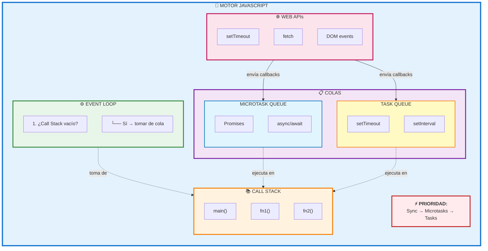
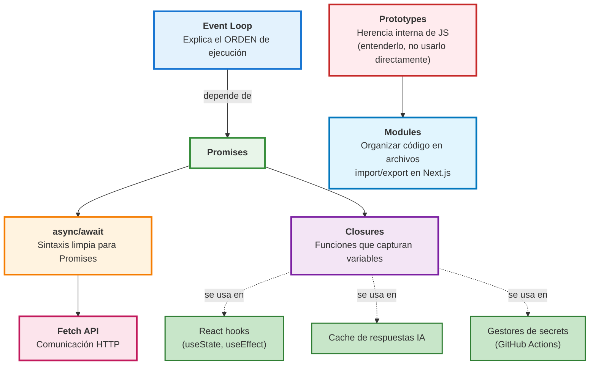

# Módulo 03 — JavaScript Avanzado

> 🤔 *Ya conoces la sintaxis de ES6+. Pero, ¿sabes realmente CÓMO ejecuta JavaScript tu código? ¿Por qué un `setTimeout(fn, 0)` NO se ejecuta inmediatamente?*

## Objetivo

Comprender los mecanismos internos de JavaScript que hacen funcionar React, Next.js y GitHub Actions: el Event Loop, la asincronía, closures, prototipos y el sistema de módulos.

---

## Contenido

| # | Lección | Concepto | Relevancia |
|---|---------|----------|------------|
| 1 | [Event Loop](01-event-loop.md) | Call Stack, Task Queue, Microtasks | Entender por qué React re-renderiza así |
| 2 | [Async/Await y Promises](02-async-await-promises.md) | Asincronía, `fetch`, manejo de errores | APIs de IA, Server Components |
| 3 | [Closures](03-closures.md) | Funciones que "recuerdan" su entorno | Cache, hooks, estado privado |
| 4 | [Prototypes](04-prototypes.md) | Herencia prototípica | Entender React internals |
| 5 | [Modules (import/export)](05-modules-import-export.md) | Sistema de módulos ES6 | Estructura de proyectos Next.js |
| 6 | [JSON y Fetch API](06-json-y-fetch.md) | Parseo de datos, peticiones HTTP | Comunicación con APIs IA |

---

## 📊 Diagrama: Cómo Fluye la Ejecución de JS



---

## Diagrama de Relaciones entre Conceptos



---

## Prerequisitos

- [Módulo 02](../02-javascript-fundamentos/README.md) completado
- Sabes usar `let`/`const`, arrow functions, desestructuración

---

## 🛠️ Ejercicio Integrador

Al terminar este módulo, deberías poder predecir el orden de salida de este código **sin ejecutarlo**:

```javascript
console.log('1');

setTimeout(() => console.log('2'), 0);

Promise.resolve().then(() => console.log('3'));

async function demo() {
  console.log('4');
  await Promise.resolve();
  console.log('5');
}

demo();

console.log('6');
```

<details>
<summary>🔍 Ver respuesta</summary>

```
1 → 4 → 6 → 3 → 5 → 2

Explicación:
1  - síncrono
4  - síncrono (dentro de demo, antes del await)
6  - síncrono
3  - microtask (Promise.then)
5  - microtask (continuación del await)
2  - macrotask (setTimeout)
```
</details>

---

[⬅️ Volver al índice](../../README.md) · [Siguiente módulo: React y Next.js ➡️](../04-react-nextjs/README.md)
