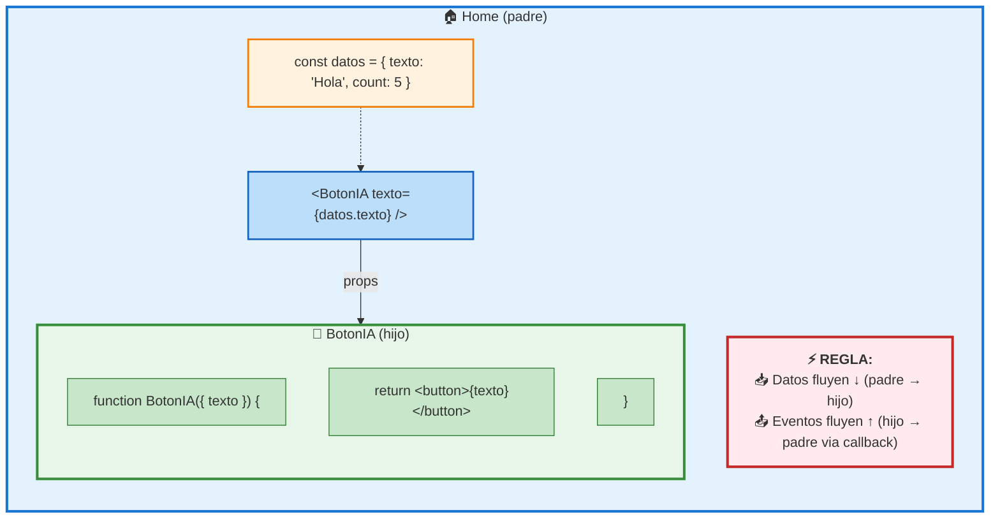

# 02 · Componentes y Props

> 🤔 *¿Qué es un componente React? ¿Es una función, una clase, un objeto? ¿Cómo le paso datos sin usar variables globales?*

**Respuesta**: Un componente es una **función** que retorna JSX (HTML-like). Le pasas datos vía **props** (como parámetros de función).

---

## 💡 Componente Básico

```typescript
// ✅ Un componente es una función que retorna JSX
export default function Saludo() {
  return <h1>Hola, DevOps!</h1>;
}
```

### JSX = JavaScript + XML

```typescript
function Demo() {
  const nombre = 'DevOps';
  const activo = true;

  return (
    <div>
      {/* Expresiones JS entre llaves */}
      <h1>Hola, {nombre}</h1>
      <p>Estado: {activo ? '🟢 Activo' : '🔴 Inactivo'}</p>
      <p>Tokens: {100 + 200}</p>
    </div>
  );
}
```

---

## 💡 Props: Pasar Datos entre Componentes

```typescript
// Definir props con TypeScript
interface BotonProps {
  texto: string;
  onClick: () => void;
  className?: string;    // ? = opcional
}

// Componente que RECIBE props (desestructuración)
export default function BotonIA({ texto, onClick, className = '' }: BotonProps) {
  return (
    <button
      onClick={onClick}
      className={`px-4 py-2 bg-blue-500 text-white rounded ${className}`}
    >
      {texto}
    </button>
  );
}

// Componente que PASA props
function Home() {
  const handleClick = () => console.log('¡Click!');

  return (
    <div>
      <BotonIA texto="Preguntar IA" onClick={handleClick} />
      <BotonIA texto="Cancelar" onClick={() => {}} className="bg-red-500" />
    </div>
  );
}
```

---

## 📊 Diagrama: Flujo de Props



---

## Composición: Componentes Dentro de Componentes

```typescript
function ListaServidores({ servidores }: { servidores: string[] }) {
  return (
    <ul>
      {servidores.map(srv => (
        <li key={srv}>{srv}</li>
      ))}
    </ul>
  );
}

function Dashboard() {
  return (
    <div>
      <h1>Dashboard K8s</h1>
      <ListaServidores servidores={['prod-01', 'prod-02', 'staging']} />
      <BotonIA texto="Refrescar" onClick={() => location.reload()} />
    </div>
  );
}
```

---

## `children`: Props Especial

```typescript
function Card({ children, titulo }: { children: React.ReactNode; titulo: string }) {
  return (
    <div className="border rounded p-4 shadow">
      <h2 className="font-bold mb-2">{titulo}</h2>
      {children}  {/* Lo que pongas DENTRO del tag */}
    </div>
  );
}

// Uso
<Card titulo="Métricas">
  <p>CPU: 45%</p>
  <p>RAM: 78%</p>
</Card>
```

---

## 🛠️ Ejercicio

Crea un componente `<ServidorCard>` que reciba `nombre`, `ip`, `estado` como props y muestre una tarjeta con estilo según el estado:

<details>
<summary>🔍 Ver respuesta</summary>

```typescript
interface ServidorCardProps {
  nombre: string;
  ip: string;
  estado: 'activo' | 'caido' | 'mantenimiento';
}

const colores = {
  activo: 'bg-green-100 border-green-500',
  caido: 'bg-red-100 border-red-500',
  mantenimiento: 'bg-yellow-100 border-yellow-500'
};

const iconos = { activo: '🟢', caido: '🔴', mantenimiento: '🟡' };

export default function ServidorCard({ nombre, ip, estado }: ServidorCardProps) {
  return (
    <div className={`p-4 border-l-4 rounded ${colores[estado]}`}>
      <h3>{iconos[estado]} {nombre}</h3>
      <p className="text-sm text-gray-600">{ip}</p>
      <span className="text-xs uppercase">{estado}</span>
    </div>
  );
}
```
</details>

---

[⬅️ Volver al módulo](README.md) · [Siguiente: Hooks y Estado ➡️](03-hooks-estado.md)
