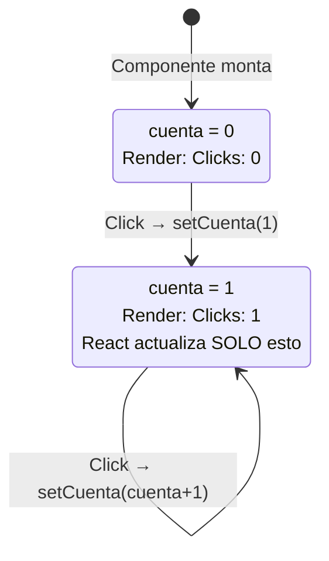
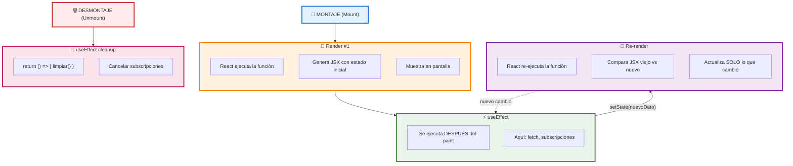

# 03 · Hooks y Estado (useState, useEffect)

> 🤔 *Si un componente es solo una función, ¿cómo "recuerda" que el usuario escribió algo en un input? Las variables locales se destruyen al terminar la función...*

**Respuesta**: Los **hooks** (`useState`, `useEffect`) son funciones especiales de React que permiten a los componentes funcionales tener estado y efectos secundarios. Internamente, React guarda estos valores asociados al componente.

---

## 💡 `useState` — Estado Local

```typescript
'use client';  // Obligatorio para hooks
import { useState } from 'react';

export default function Contador() {
  // useState retorna [valorActual, funciónParaCambiar]
  const [cuenta, setCuenta] = useState(0);

  return (
    <div>
      <p>Clicks: {cuenta}</p>
      <button onClick={() => setCuenta(cuenta + 1)}>+1</button>
      <button onClick={() => setCuenta(0)}>Reset</button>
    </div>
  );
}
```

### Diagrama del Re-render



---

## 💡 `useEffect` — Efectos Secundarios

```typescript
'use client';
import { useState, useEffect } from 'react';

export default function DatosIA() {
  const [datos, setDatos] = useState(null);
  const [loading, setLoading] = useState(true);

  useEffect(() => {
    // Se ejecuta DESPUÉS del render
    async function cargar() {
      const res = await fetch('/api/datos');
      const data = await res.json();
      setDatos(data);
      setLoading(false);
    }
    cargar();
  }, []);  // [] = ejecutar solo una vez (al montar)

  if (loading) return <p>Cargando...</p>;
  return <pre>{JSON.stringify(datos, null, 2)}</pre>;
}
```

### Diagrama del Ciclo de Vida



---

## Array de Dependencias

```typescript
// ① Sin array → ejecuta en CADA render
useEffect(() => {
  console.log('Cada render');
});

// ② Array vacío → ejecuta solo al MONTAR
useEffect(() => {
  console.log('Solo una vez');
}, []);

// ③ Con dependencias → cuando cambien
useEffect(() => {
  console.log(`Prompt cambió a: ${prompt}`);
  fetchIA(prompt);
}, [prompt]);  // Se re-ejecuta cuando 'prompt' cambie
```

---

## 🔗 Ejemplo Completo: Chat IA

```typescript
'use client';
import { useState, useEffect } from 'react';
import crearCacheIA from '@/lib/ai';

export default function ChatIA() {
  const [respuesta, setRespuesta] = useState('');
  const [loading, setLoading] = useState(false);
  const gpt = crearCacheIA(3);  // Closure vivo entre renders

  useEffect(() => {
    // Mensaje inicial al montar
    gpt('inicialización').then(setRespuesta);
  }, []);

  const handlePregunta = async () => {
    setLoading(true);
    const resp = await gpt('¿Qué es un DevOps en 2026?');
    setRespuesta(resp);
    setLoading(false);
  };

  return (
    <div className="max-w-2xl mx-auto">
      <h1 className="text-3xl font-bold mb-8">🤖 Chat IA</h1>

      {loading ? (
        <p>Cargando respuesta IA...</p>
      ) : (
        <div className="p-4 bg-gray-100 rounded">
          <pre>{respuesta}</pre>
        </div>
      )}

      <button onClick={handlePregunta} disabled={loading}>
        Preguntar
      </button>
    </div>
  );
}
```

---

## ⚠️ Errores Comunes

```
❌ Llamar hooks dentro de if/for
   if (cond) { useState(0); }  // ERROR

❌ Olvidar 'use client'
   useState en Server Component → ERROR

❌ Dependencia faltante en useEffect
   useEffect(() => { fetch(url) }, []);
   // Si 'url' cambia, el efecto NO se re-ejecuta

✅ Hooks siempre al INICIO del componente
✅ 'use client' en la primera línea
✅ Incluir todas las dependencias que el efecto usa
```

---

## 🛠️ Ejercicio Socrático

Si haces click en "Preguntar" **dos veces con el mismo texto**:
- Primera vez: `"🤖 IA: ¿QUÉ ES UN DEVOPS EN 2026?"` (800ms)
- Segunda vez: `"✅ Cache HIT"` (instantáneo)

**¿Por qué?** → El closure de `crearCacheIA` mantiene el `Map` vivo entre renders.

---

[⬅️ Volver al módulo](README.md) · [Siguiente: Server vs Client Components ➡️](04-server-vs-client.md)
