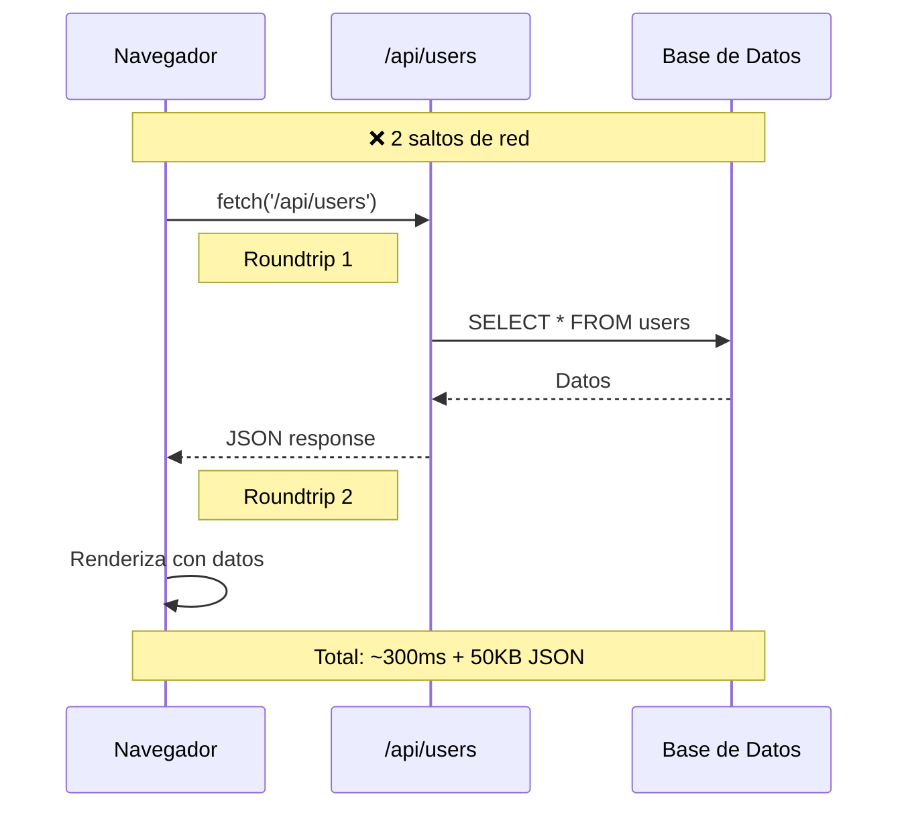
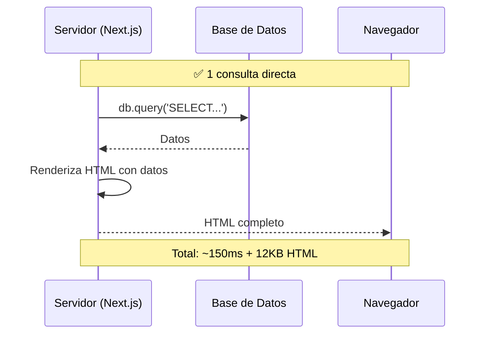
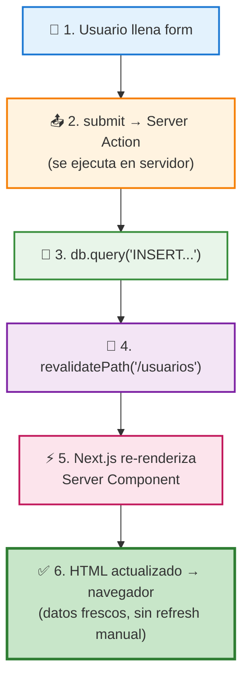

# 05 · Base de Datos con Server Components

> 🤔 *En una SPA tradicional necesitas: `page → fetch('/api/users') → API route → DB → JSON → page`. Con Server Components, ¿puedes saltarte pasos?*

**Respuesta**: Sí. Server Components pueden acceder a la base de datos **directamente** sin API intermedia. Menos código, menos latencia, más seguro.

---

## 📊 Diagrama: Antes vs Ahora

### SPA Tradicional (ANTES)



### Server Components (AHORA)



---

## Server Component con Query Directa

```typescript
// src/app/usuarios/page.tsx — SERVER (por defecto)
import { db } from '@/lib/db';

export default async function UsuariosPage() {
  // 🚀 Query DIRECTA (sin API, sin fetch)
  const usuarios = await db.query('SELECT * FROM usuarios');

  return (
    <div className="p-8 max-w-6xl mx-auto">
      <h1 className="text-4xl font-bold mb-8">👥 Usuarios</h1>

      <div className="grid gap-4">
        {usuarios.map((user: any) => (
          <div key={user.id} className="p-4 bg-white shadow rounded">
            <h3 className="font-bold">{user.nombre}</h3>
            <p className="text-gray-600">{user.email} — {user.rol}</p>
          </div>
        ))}
      </div>
    </div>
  );
}
```

---

## Server Actions: Mutaciones desde el Cliente

> 🤔 *Si el formulario está en un Client Component, ¿cómo guarda datos en la DB del servidor sin crear una API route?*

**Respuesta**: **Server Actions** — funciones que se ejecutan en el servidor pero se invocan desde el cliente.

```typescript
// src/app/usuarios/actions.ts
'use server';  // ← Directiva de Server Action

import { db } from '@/lib/db';
import { revalidatePath } from 'next/cache';

export async function crearUsuario(formData: FormData) {
  const nombre = formData.get('nombre') as string;
  const email = formData.get('email') as string;

  await db.query(
    'INSERT INTO usuarios (nombre, email, rol) VALUES (?, ?, ?)',
    [nombre, email, 'user']
  );

  revalidatePath('/usuarios');  // Recarga datos frescos
}
```

```typescript
// src/components/FormularioUsuario.tsx
'use client';
import { crearUsuario } from '@/app/usuarios/actions';

export default function FormularioUsuario() {
  return (
    <form action={crearUsuario} className="space-y-4">
      <input name="nombre" placeholder="Nombre" required
             className="w-full p-2 border rounded" />
      <input name="email" type="email" placeholder="Email" required
             className="w-full p-2 border rounded" />
      <button type="submit"
              className="px-6 py-2 bg-blue-500 text-white rounded">
        💾 Guardar
      </button>
    </form>
  );
}
```

---

## 📊 Diagrama: Flujo con Server Actions



---

## 🔗 Ejemplo Real: Chat con Historial en DB

```typescript
// src/app/chat/page.tsx — SERVER
import { db } from '@/lib/db';
import ChatClient from '@/components/ChatClient';

export default async function ChatPage() {
  const historial = await db.query(
    'SELECT * FROM prompts ORDER BY created_at DESC LIMIT 20'
  );

  return (
    <div className="max-w-2xl mx-auto p-8">
      <h1>💬 Chat con Historial</h1>

      {/* Historial renderizado en servidor (SEO, rápido) */}
      <div className="space-y-2 mb-8">
        {historial.map((chat: any) => (
          <div key={chat.id} className="p-3 bg-gray-50 rounded">
            <p><strong>Tú:</strong> {chat.texto}</p>
            <p><strong>IA:</strong> {chat.respuesta_ia}</p>
            <p className="text-xs text-gray-400">
              {chat.tokens} tokens
            </p>
          </div>
        ))}
      </div>

      {/* Input interactivo en cliente */}
      <ChatClient />
    </div>
  );
}
```

---

## Ventajas Medibles

```
ANTES (API tradicional):
  • fetch → /api/usuarios → DB → JSON → render
  • 300ms + 50KB JSON por request
  • Bundle: 120KB JS

AHORA (Server Components + DB):
  • db.query() → render → HTML
  • 150ms total (1 hop)
  • Bundle: 12KB JS (85% menos)
  • Datos nunca expuestos al cliente
```

---

[⬅️ Volver al módulo](README.md) · [Siguiente módulo: GitHub Actions ➡️](../05-github-actions/README.md)
