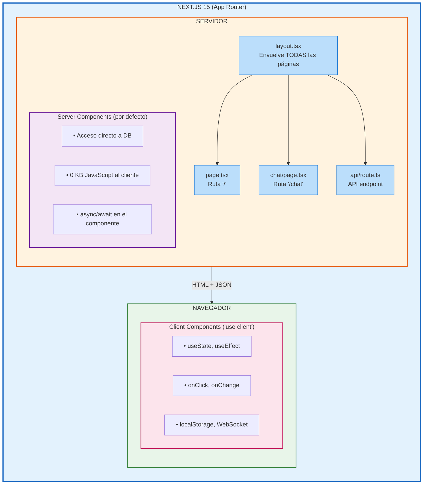

# Módulo 04 — React y Next.js 15

> 🤔 *Si JavaScript ya puede manipular el DOM, ¿por qué necesitamos React? ¿Y si React ya existe, por qué Next.js?*

## Objetivo

Crear tu primera aplicación web con React + Next.js 15, entendiendo componentes, estado, hooks, la diferencia entre Server y Client Components, y cómo conectar una base de datos.

---

## Contenido

| # | Lección | Concepto | Resultado |
|---|---------|----------|-----------|
| 1 | [Proyecto Next.js](01-proyecto-nextjs.md) | Scaffolding, estructura, App Router | App corriendo en localhost |
| 2 | [Componentes y Props](02-componentes-y-props.md) | JSX, props, composición | Componentes reutilizables |
| 3 | [Hooks y Estado](03-hooks-estado.md) | `useState`, `useEffect`, ciclo de vida | Interactividad |
| 4 | [Server vs Client Components](04-server-vs-client.md) | `'use client'`, SSR, hidratación | Rendimiento óptimo |
| 5 | [Base de Datos con Server Components](05-base-de-datos.md) | DB directa, Server Actions | CRUD completo |

---

## 📊 Diagrama: Arquitectura Next.js 15



---

## Diagrama: Flujo de Ejecución

```
npm run dev
     │
     ▼
┌─ SERVIDOR ──────────────────────────────────────┐
│  1. Next.js importa layout.tsx                   │
│  2. Importa dependencias (math.ts, ai.ts)        │
│  3. Request "/" → ejecuta page.tsx               │
│  4. Render Server Components → HTML              │
└───────────────────────┬──────────────────────────┘
                        │ Stream HTML
                        ▼
┌─ NAVEGADOR ─────────────────────────────────────┐
│  5. Muestra HTML (paint inmediato)               │
│  6. Hidrata Client Components                    │
│  7. useEffect ejecuta (asíncrono)                │
│  8. Eventos activos (onClick, etc.)              │
└──────────────────────────────────────────────────┘

ORDEN: layout → page → components → useEffect
TIPO:  SYNC     SYNC    SYNC        ASYNC
```

---

## Prerequisitos

- [Módulo 03](../03-javascript-avanzado/README.md) completado
- Node.js 20+ instalado
- Entiendes async/await, closures y modules

---

[⬅️ Volver al índice](../../README.md) · [Siguiente módulo: GitHub Actions ➡️](../05-github-actions/README.md)
