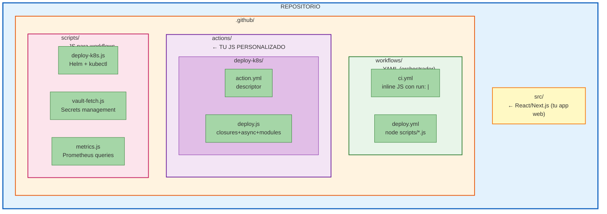

# 01 · JavaScript Aplicado a GitHub Actions

> 🤔 *¿Qué conceptos de JS moderno que ya dominas aplican directamente en GitHub Actions? ¿Cuáles NO?*

---

## 💡 Mapeo Completo: JS → Actions

| Concepto JS | Uso en Actions | Ejemplo Real |
|-------------|----------------|--------------|
| ✅ **Async/await** | Custom Actions con API | `await fetchK8sStatus()` |
| ✅ **Closures** | Reutilizar secrets/config | `const vault = createVaultClient()` |
| ✅ **Modules** | Action libraries | `import { deployK8s } from './deploy'` |
| ✅ **let/const** | Manejo estado job | `const artifacts = new Map()` |
| ✅ **Arrow functions** | Callbacks | `onFailure: () => notifySlack()` |
| ✅ **Destructuring** | Parsear GitHub context | `const { ref, sha } = github` |
| ✅ **Template literals** | Comandos dinámicos | `` `helm upgrade --set tag=${sha}` `` |
| ✅ **JSON + fetch** | APIs, webhooks | `await fetch(awxUrl)` |
| ❌ **React/Next.js** | No aplica | Solo para tu app web |

---

## 📊 Diagrama: Dónde Vive tu JS



---

## 🔗 Conexión con tu Stack DevOps

```
TUS HERRAMIENTAS ACTUALES           JS EN ACTIONS
─────────────────────────           ──────────────
AWX/Ansible                    →    node scripts/ansible.js
K8s/MicroK8s                   →    Helm + kubectl actions
GitHub Actions local (act)     →    Pruebas offline
Vault                          →    Secrets management actions
Prometheus                     →    Metrics collection actions
```

---

## Tres Formas de Usar Node.js en Actions

### 1. Inline en YAML (rápido, < 10 líneas)

```yaml
- name: Quick check
  run: |
    node -e "
      const { ref, sha } = JSON.parse('${{ toJSON(github) }}');
      console.log(\`Deploying \${ref} @ \${sha.slice(0, 7)}\`);
    "
```

### 2. Script externo (10-100 líneas)

```yaml
- name: Deploy K8s
  run: node scripts/deploy-k8s.js
  env:
    CLUSTER: production
    K8S_TOKEN: ${{ secrets.K8S_TOKEN }}
```

### 3. Composite Action (reutilizable, compartible)

```yaml
- name: Deploy
  uses: ./.github/actions/deploy-k8s
  with:
    cluster: production
```

---

## ⚠️ Recuerda

```
SIN setup-node:  node --version → v16.x (aleatorio, viejo)
CON setup-node:  node --version → v20.10.0 (controlado)

REGLA: SIEMPRE usa actions/setup-node@v4 antes de
       cualquier comando npm o node
```

---

[⬅️ Volver al módulo](README.md) · [Siguiente: Composite Actions ➡️](02-composite-actions.md)
