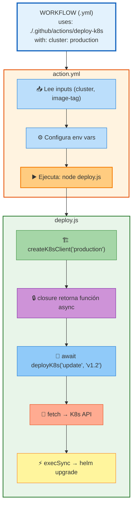

# 02 · Composite Actions Personalizadas

> 🤔 *Si tu equipo despliega a K8s en 5 repos diferentes, ¿copias el mismo YAML 5 veces? ¿O creas UNA Action reutilizable?*

**Respuesta**: Creas una **Composite Action** — un bloque reutilizable que empaqueta tus steps (incluyendo JS) como una acción invocable con `uses:`.

---

## 📁 Estructura de una Composite Action

```
.github/actions/deploy-k8s/
├── action.yml          ← Descriptor (inputs/outputs/steps)
└── deploy.js           ← Tu JS moderno
```

---

## 💡 Ejemplo Completo: Deploy K8s Action

### `action.yml` — Descriptor

```yaml
name: 'Deploy K8s'
description: 'Despliega a Kubernetes con Helm'
inputs:
  cluster:
    description: 'Nombre del cluster K8s'
    required: true
  image-tag:
    description: 'Tag de la imagen Docker'
    default: 'latest'
runs:
  using: 'composite'
  steps:
    - name: Deploy con JS
      run: node ${{ github.action_path }}/deploy.js
      shell: bash
      env:
        CLUSTER: ${{ inputs.cluster }}
        IMAGE: ${{ inputs.image-tag }}
        K8S_TOKEN: ${{ env.K8S_TOKEN }}
```

### `deploy.js` — Todo tu JS Aprendido

```javascript
// ✅ IMPORTS (modules)
import { execSync } from 'child_process';
import fetch from 'node-fetch';

// ✅ CLOSURE: Cliente K8s reutilizable
function createK8sClient(cluster) {
  const secrets = { token: process.env.K8S_TOKEN };  // 🔒 encapsulado
  let deployments = 0;

  return async function(action, image) {
    deployments++;
    console.log(`🚀 Deploy #${deployments} a ${cluster}`);

    // ✅ ASYNC/AWAIT + FETCH
    const response = await fetch(`https://k8s-api/${cluster}/deploy`, {
      method: 'POST',
      headers: { Authorization: `Bearer ${secrets.token}` },
      body: JSON.stringify({ action, image })
    });

    const result = await response.json();
    return { success: result.status === 200, deployments };
  };
}

// ✅ ARROW + DESTRUCTURING + TEMPLATE LITERALS
const main = async () => {
  const { CLUSTER, IMAGE = 'latest' } = process.env;
  const deployK8s = createK8sClient(CLUSTER);

  const result = await deployK8s('update', IMAGE);
  console.log(`✅ Deployed ${result.deployments} veces a ${CLUSTER}`);

  // ✅ HELM via child_process
  execSync(`helm upgrade mi-app ./charts --set image.tag=${IMAGE}`, {
    stdio: 'inherit'
  });
};

main().catch(error => {
  console.error('❌ Deploy falló:', error.message);
  process.exit(1);
});
```

---

## 📊 Diagrama: Flujo de la Action



---

## Uso en Workflow

```yaml
name: 🚀 Deploy Prod
on:
  push:
    branches: [main]

jobs:
  deploy:
    runs-on: ubuntu-latest
    steps:
      - uses: actions/checkout@v4

      # ✅ TU ACTION PERSONALIZADA
      - name: Deploy K8s
        uses: ./.github/actions/deploy-k8s
        with:
          cluster: production
          image-tag: ${{ github.sha }}
        env:
          K8S_TOKEN: ${{ secrets.K8S_TOKEN }}
```

---

## Otro Ejemplo: Cache Manager con Closures

```javascript
// .github/actions/cache-npm/action.js
function createCacheManager() {
  const cache = new Map();  // ✅ CLOSURE

  return async function(cacheKey, data) {
    if (cache.has(cacheKey)) {
      console.log('✅ Cache HIT');
      return cache.get(cacheKey);
    }

    const result = await processData(data);
    cache.set(cacheKey, result);
    return result;
  };
}

const cacheNpm = createCacheManager();
export default cacheNpm;
```

---

## 🛠️ Ejercicio

Crea una Composite Action que:
1. Reciba `vault-addr` y `vault-token` como inputs
2. Use una closure para crear un Vault client
3. Fetch un secret y lo exponga como output

<details>
<summary>🔍 Ver estructura</summary>

```
.github/actions/vault-fetch/
├── action.yml
│   inputs: vault-addr, vault-token, secret-path
│   outputs: secret-value
│   runs: node vault-fetch.js
└── vault-fetch.js
    createVaultClient(addr, token)  ← closure
    await client.getSecret(path)    ← async/await
    ::set-output name=...::         ← output
```
</details>

---

[⬅️ Volver al módulo](README.md) · [Siguiente: Node.js en Workflows ➡️](03-nodejs-en-workflows.md)
