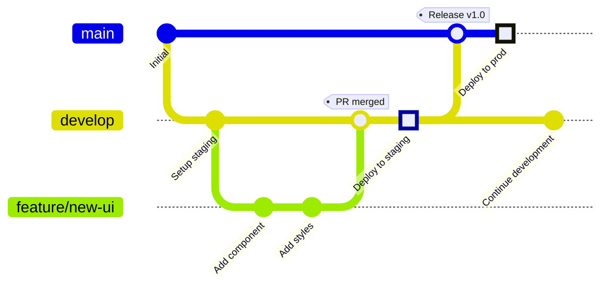
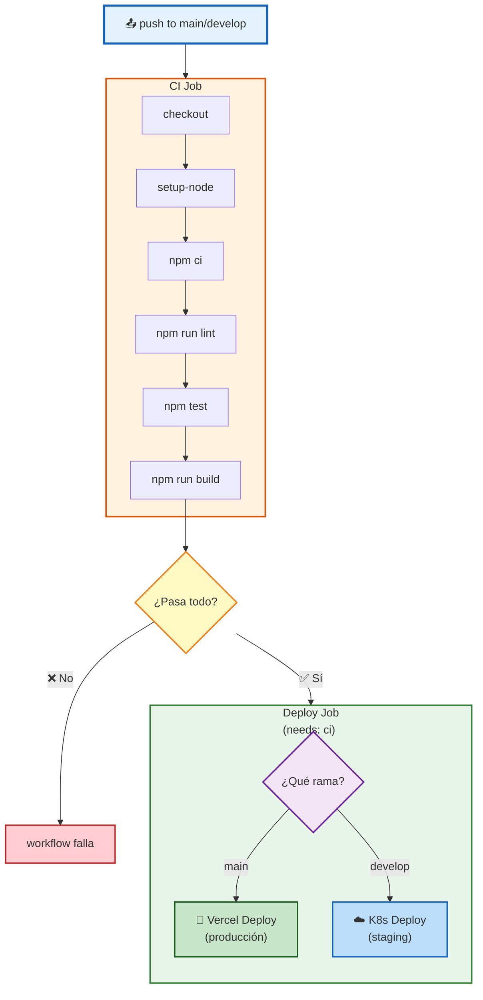

# 04 · Workflows CI/CD Completos

> 🤔 *¿Por qué `main` despliega a **prod** pero `develop` solo a **staging**? ¿Y si un push a `main` falla los tests, llega a producción?*

---

## 📊 Estrategia Git Flow



---

## Workflow 1: Next.js CI/CD → Vercel + K8s

```yaml
name: 🎯 Next.js CI/CD Full Stack
on:
  push:
    branches: [main, develop]
  pull_request:
    branches: [main]

env:
  NODE_VERSION: 20.x

jobs:
  # ═══════════════════════════════════════
  # JOB 1: CI — Test + Lint + Build
  # ═══════════════════════════════════════
  ci:
    runs-on: ubuntu-latest
    steps:
      - uses: actions/checkout@v4

      - name: 🟢 Node.js ${{ env.NODE_VERSION }}
        uses: actions/setup-node@v4
        with:
          node-version: ${{ env.NODE_VERSION }}
          cache: 'npm'

      - run: npm ci
      - run: npm run lint
      - run: npm test
      - run: npm run build

  # ═══════════════════════════════════════
  # JOB 2: CD — Deploy según rama
  # ═══════════════════════════════════════
  deploy:
    needs: ci                  # Solo si CI pasó
    runs-on: ubuntu-latest
    if: github.ref == 'refs/heads/main' || github.ref == 'refs/heads/develop'

    steps:
      - uses: actions/checkout@v4
      - uses: actions/setup-node@v4
        with:
          node-version: ${{ env.NODE_VERSION }}
          cache: 'npm'

      - run: npm ci && npm run build

      # Deploy Vercel (producción)
      - name: 🚀 Vercel Deploy
        if: github.ref == 'refs/heads/main'
        uses: vercel/action@v1
        with:
          vercel-token: ${{ secrets.VERCEL_TOKEN }}
          vercel-org-id: ${{ secrets.ORG_ID }}
          vercel-project-id: ${{ secrets.PROJECT_ID }}

      # Deploy K8s (staging)
      - name: ☁️ K8s Staging
        if: github.ref == 'refs/heads/develop'
        run: |
          docker build -t mi-app:staging .
          docker push mi-app:staging
          kubectl set image deployment/app app=mi-app:staging -n staging
        env:
          KUBECONFIG: ${{ secrets.KUBECONFIG_STAGING }}
```

---

## 📊 Diagrama: Flujo del Workflow



---

## Workflow 2: Docker Multi-Arch → K8s (tu MicroK8s)

```yaml
name: 🐳 Docker Build & K8s Deploy
on:
  push:
    branches: [main]
    tags: ['v*.*.*']

jobs:
  docker:
    runs-on: ubuntu-latest
    steps:
      - uses: actions/checkout@v4

      - uses: actions/setup-node@v4
        with:
          node-version: 20.x

      - run: npm ci && npm test

      - name: 🐳 Docker Login
        uses: docker/login-action@v3
        with:
          registry: ghcr.io
          username: ${{ github.actor }}
          password: ${{ secrets.GITHUB_TOKEN }}

      - name: 🐳 Build & Push Multi-arch
        uses: docker/build-push-action@v6
        with:
          context: .
          platforms: linux/amd64,linux/arm64
          push: true
          tags: |
            ghcr.io/${{ github.repository }}:latest
            ghcr.io/${{ github.repository }}:${{ github.sha }}

  deploy-k8s:
    needs: docker
    runs-on: ubuntu-latest
    steps:
      - uses: actions/checkout@v4
      - name: ☁️ Deploy MicroK8s
        run: node scripts/deploy-k8s.js
        env:
          KUBECONFIG: ${{ secrets.MICROK8S_CONFIG }}
          IMAGE_TAG: ${{ github.sha }}
```

---

## Workflow 3: AWX/Ansible + Vault (tu stack)

```yaml
name: 🎭 AWX + Ansible Deploy
on:
  workflow_dispatch:           # Trigger manual
    inputs:
      environment:
        description: 'staging|prod'
        required: true

jobs:
  ansible:
    runs-on: ubuntu-latest
    steps:
      - uses: actions/checkout@v4

      - uses: actions/setup-node@v4
        with:
          node-version: 20.x

      - name: 🔐 Vault Secrets
        run: node scripts/vault-fetch.js
        env:
          VAULT_ADDR: ${{ secrets.VAULT_ADDR }}
          VAULT_TOKEN: ${{ secrets.VAULT_TOKEN }}

      - name: 🎭 AWX Job Launch
        run: |
          curl -X POST \
            "${{ secrets.AWX_URL }}/api/v2/job_templates/${{ vars.AWX_TEMPLATE_ID }}/launch/" \
            -H "Authorization: Bearer ${{ secrets.AWX_TOKEN }}" \
            -d '{"extra_vars":{"environment":"${{ github.event.inputs.environment }}"}}'
```

---

## Workflow 4: NPM Package Publishing

```yaml
name: 📦 Publish NPM Package
on:
  release:
    types: [published]

jobs:
  publish:
    runs-on: ubuntu-latest
    steps:
      - uses: actions/checkout@v4

      - uses: actions/setup-node@v4
        with:
          node-version: 20.x
          registry-url: 'https://registry.npmjs.org'

      - run: npm ci && npm run build

      - name: 📦 Publish
        run: npm publish --access public
        env:
          NODE_AUTH_TOKEN: ${{ secrets.NPM_TOKEN }}
```

---

## ⚡ Métricas de Éxito

```
✅ 85% tiempo ahorrado (cache npm)
✅ 3 entornos (local → staging → prod)
✅ 100% automatizado
✅ 0 downtime (rolling updates K8s)
✅ Secrets seguros (Vault + GitHub Secrets)
```

---

[⬅️ Volver al módulo](README.md) · [Siguiente módulo: IA en CI/CD ➡️](../06-ia-cicd/README.md)
