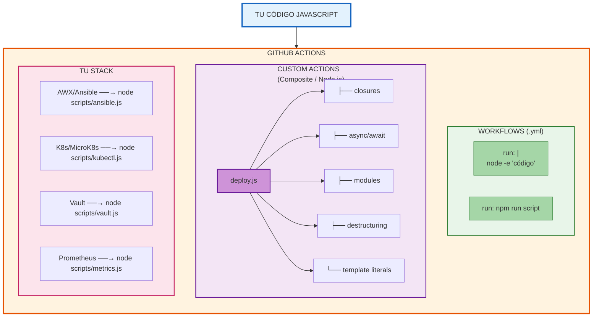

# Módulo 05 — GitHub Actions con JavaScript

> 🤔 *Si el 95% del JavaScript que aprendiste aplica directamente en GitHub Actions, ¿por qué no crear tus propias Actions profesionales en vez de depender de las del marketplace?*

## Objetivo

Dominar el uso de JavaScript/Node.js dentro de GitHub Actions: desde inline scripts hasta Composite Actions completas, workflows CI/CD para Next.js, y despliegues a K8s/AWX.

---

## Contenido

| # | Lección | Concepto | Resultado |
|---|---------|----------|-----------|
| 1 | [JS Aplicado a Actions](01-js-en-actions.md) | Mapeo conceptos JS → Actions | Entender qué JS aplica y dónde |
| 2 | [Composite Actions](02-composite-actions.md) | Crear Actions personalizadas | Tu primera Action con closures + async |
| 3 | [Node.js en Workflows](03-nodejs-en-workflows.md) | setup-node, scripts, matrix | CI profesional con Node.js |
| 4 | [Workflows CI/CD Completos](04-workflows-completos.md) | Next.js → Docker → K8s | Pipeline production-ready |

---

## 📊 Diagrama: JS en GitHub Actions

---

## Prerequisitos

- [Módulo 03](../03-javascript-avanzado/README.md) completado (closures, async, modules)
- Cuenta GitHub con Actions habilitado
- Familiaridad con YAML básico

---

[⬅️ Volver al índice](../../README.md) · [Siguiente módulo: IA en CI/CD ➡️](../06-ia-cicd/README.md)
