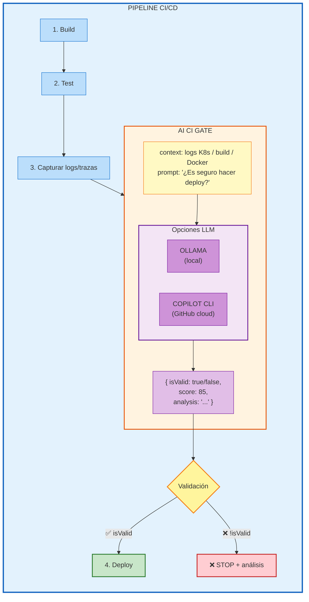

# Módulo 06 — IA en CI/CD: LLM Gate

> 🤔 *¿Y si tu pipeline pudiera "leer" los logs de un pod crasheando y decidir solo si el deploy es seguro? ¿Un gate inteligente que entiende contexto, no solo exit codes?*

## Objetivo

Crear GitHub Actions que usen LLMs (Ollama/Llama local o GitHub Copilot CLI) para validar logs de CI/CD, analizar errores K8s/Java/Python y actuar como un gate de calidad basado en IA.

---

## Contenido

| # | Lección | Herramienta | Resultado |
|---|---------|-------------|-----------|
| 1 | [LLM CI Validator (Ollama)](01-llm-validator-ollama.md) | Ollama + Llama | Gate IA con modelo local |
| 2 | [Copilot CLI Validator](02-copilot-cli-validator.md) | GitHub Copilot CLI | Gate IA con contexto de repo |

---

## 📊 Diagrama: AI CI Gate



---

## 📊 Diagrama: JS Moderno en el Validador

```
validator.js usa TODO lo aprendido:

  MODULES     →  import fetch from 'node-fetch'
  CLOSURES    →  createLLMClient(url) { cache = new Map() }
  ASYNC/AWAIT →  const result = await llm(prompt, context)
  DESTRUCTURE →  const { CONTEXT, PROMPT } = process.env
  TEMPLATES   →  `CONTEXTO CI/CD:\n${context}\n...`
  JSON        →  JSON.parse(result.response)
  FETCH       →  await fetch(url, { method: 'POST', ... })
```

---

## Prerequisitos

- [Módulo 05](../05-github-actions/README.md) completado
- Ollama instalado localmente (o PAT de GitHub Copilot)
- Entiendes closures, async/await, modules, fetch, JSON

---

[⬅️ Volver al índice](../../README.md) · [⬅️ Módulo anterior: GitHub Actions](../05-github-actions/README.md)
