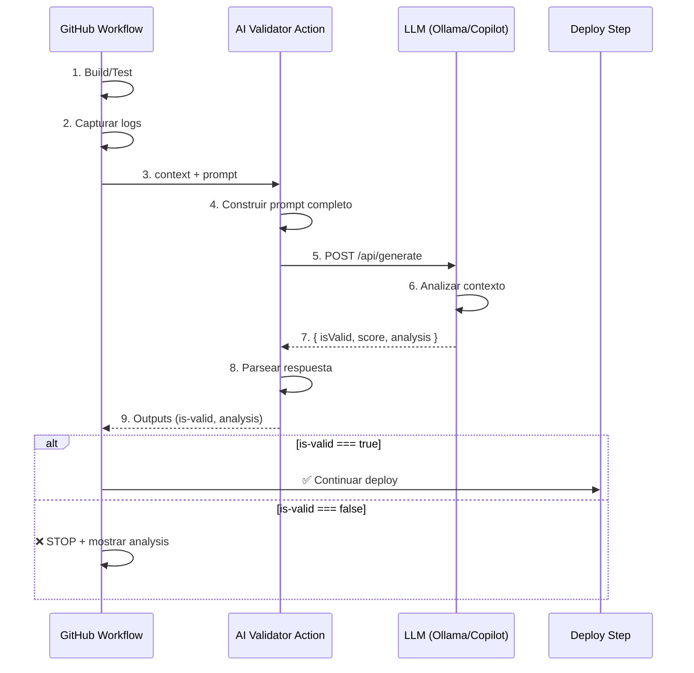

# 🤖 Ejemplos IA en CI/CD

Ejemplos listos para usar que integran **LLMs (Ollama/Llama)** y **GitHub Copilot CLI** como gates inteligentes en pipelines CI/CD.

---

## 📁 Estructura

```
ejemplos/
├── README.md                           ← Estás aquí
│
├── ollama-validator/                   ← LLM local (Ollama/Llama)
│   ├── action.yml                      ← Composite Action
│   ├── src/
│   │   ├── validator.js                ← Cliente LLM con closures
│   │   └── package.json
│   └── examples/
│       ├── k8s-pod-failed.json         ← Contexto de ejemplo (logs K8s)
│       └── build-errors.json           ← Logs de build con errores
│
├── copilot-validator/                  ← GitHub Copilot CLI (cloud)
│   ├── action.yml                      ← Composite Action
│   ├── src/
│   │   ├── validator.js                ← Cliente Copilot con exec
│   │   └── package.json
│   └── examples/
│       ├── test-failures.json          ← Logs de tests fallidos
│       └── deployment-logs.json        ← Logs de deployment
│
└── scripts/                            ← Utilidades standalone
    ├── llm-analyzer.js                 ← Analizador genérico LLM
    ├── prompt-builder.js               ← Constructor de prompts
    └── score-calculator.js             ← Calculador de scores CI/CD
```

---

## 🚀 Uso Rápido

### 1. **Ollama Validator** (LLM Local)

Requiere Ollama corriendo localmente o en un runner self-hosted.

```yaml
# En tu workflow .github/workflows/ci.yml
jobs:
  validate-with-llm:
    runs-on: ubuntu-latest
    steps:
      - uses: actions/checkout@v4
      
      # Capturar logs de tu app/build/tests
      - name: Capturar logs
        id: logs
        run: |
          kubectl logs pod/mi-app > /tmp/logs.txt
          echo "content=$(cat /tmp/logs.txt | jq -Rs .)" >> $GITHUB_OUTPUT
      
      # Validar con Ollama
      - name: 🤖 AI Gate
        uses: ./.github/actions/ollama-validator
        with:
          context: ${{ steps.logs.outputs.content }}
          prompt: "¿Hay errores críticos que impidan el deploy?"
          model: "llama3.2"
          llm-url: "http://localhost:11434"
```

**Copiar action a tu repo**:
```bash
cp -r ejemplos/ollama-validator .github/actions/
```

---

### 2. **Copilot Validator** (GitHub Cloud)

No requiere infraestructura adicional, usa tu suscripción de GitHub Copilot.

```yaml
jobs:
  validate-with-copilot:
    runs-on: ubuntu-latest
    steps:
      - uses: actions/checkout@v4
      
      - name: Capturar logs de tests
        id: test-logs
        run: |
          npm test 2>&1 | tee /tmp/test-output.txt
          echo "content=$(cat /tmp/test-output.txt | jq -Rs .)" >> $GITHUB_OUTPUT
      
      - name: 🤖 Copilot AI Gate
        uses: ./.github/actions/copilot-validator
        with:
          context: ${{ steps.test-logs.outputs.content }}
          prompt: "Analiza los tests fallidos y determina si son críticos"
          github-token: ${{ secrets.GITHUB_TOKEN }}
```

**Copiar action a tu repo**:
```bash
cp -r ejemplos/copilot-validator .github/actions/
```

---

### 3. **Scripts Standalone**

Scripts independientes para usar fuera de GitHub Actions (CI/CD local, Jenkins, GitLab, etc.)

```bash
# Analizar logs con LLM genérico
export LLM_URL="http://localhost:11434"
export LOG_FILE="./app.log"
node scripts/llm-analyzer.js

# Construir prompt óptimo para validación
node scripts/prompt-builder.js \
  --type "k8s-deployment" \
  --severity "critical"

# Calcular score de CI/CD
node scripts/score-calculator.js \
  --errors 3 \
  --warnings 10 \
  --coverage 85
```

---

## 🔧 Setup Inicial

### Opción A: Ollama (LLM Local)

1. **Instalar Ollama**:
   ```bash
   # Linux/macOS
   curl -fsSL https://ollama.com/install.sh | sh
   
   # Windows
   # Descargar desde https://ollama.com/download
   ```

2. **Descargar modelo**:
   ```bash
   ollama pull llama3.2
   # o
   ollama pull codellama
   ```

3. **Verificar**:
   ```bash
   ollama list
   curl http://localhost:11434/api/generate -d '{
     "model": "llama3.2",
     "prompt": "Hola mundo"
   }'
   ```

### Opción B: GitHub Copilot CLI

1. **Instalar Copilot CLI**:
   ```bash
   npm install -g @github/copilot-cli
   ```

2. **Autenticarse**:
   ```bash
   # Requiere suscripción GitHub Copilot activa
   gh auth login
   ```

3. **Verificar**:
   ```bash
   gh copilot suggest "listar archivos grandes"
   ```

---

## 💡 Conceptos JavaScript Demostrados

### ✅ **Closures**
```javascript
// validator.js
function createLLMClient(url) {
  const cache = new Map();  // 🔒 Estado privado
  
  return async function(prompt, context) {
    // Acceso al cache del closure
    if (cache.has(prompt)) return cache.get(prompt);
    // ...
  };
}
```

### ✅ **Async/Await + Fetch**
```javascript
const response = await fetch(llmUrl, {
  method: 'POST',
  headers: { 'Content-Type': 'application/json' },
  body: JSON.stringify({ model, prompt })
});

const result = await response.json();
```

### ✅ **Destructuring**
```javascript
const {
  CONTEXT,
  PROMPT,
  MODEL = 'llama3.2',
  LLM_URL = 'http://localhost:11434'
} = process.env;
```

### ✅ **Template Literals**
```javascript
const fullPrompt = `
CONTEXTO CI/CD:
${context}

INSTRUCCIÓN: ${prompt}

Responde en JSON: { isValid: boolean, score: number, analysis: string }
`;
```

### ✅ **JSON Parsing Robusto**
```javascript
function extractJSON(text) {
  // Buscar bloque JSON con regex
  const match = text.match(/\{[\s\S]*\}/);
  if (match) {
    return JSON.parse(match[0]);
  }
  throw new Error('No JSON found in response');
}
```

### ✅ **Modules**
```javascript
import fetch from 'node-fetch';
import { writeFileSync } from 'fs';
import { execSync } from 'child_process';
```

---

## 📊 Flujo Completo del AI Gate



---

## 📚 Casos de Uso Reales

### 1. **Validar logs de K8s antes de deploy**
```javascript
// Detectar: OOMKilled, CrashLoopBackOff, ImagePullBackOff
const context = await kubectl('logs pod/mi-app');
const result = await llmValidator(context, 
  "¿El pod tiene errores que impidan el deploy a producción?"
);
```

### 2. **Analizar cobertura de tests**
```javascript
const testOutput = execSync('npm test -- --coverage');
const result = await llmValidator(testOutput,
  "¿La cobertura es aceptable? Mínimo 80% en archivos críticos"
);
```

### 3. **Detectar vulnerabilidades en dependencias**
```javascript
const auditOutput = execSync('npm audit --json');
const result = await llmValidator(auditOutput,
  "¿Hay vulnerabilidades HIGH o CRITICAL que bloqueen el deploy?"
);
```

### 4. **Validar logs de build de Docker**
```javascript
const buildLogs = fs.readFileSync('./docker-build.log');
const result = await llmValidator(buildLogs,
  "¿El build de Docker tiene warnings críticos sobre seguridad?"
);
```

---

## 🔐 Secrets Requeridos

### Para Ollama Validator:
- **Ninguno** (LLM corre localmente)
- Opcional: `OLLAMA_URL` si usas servidor remoto

### Para Copilot Validator:
- `GITHUB_TOKEN` (automático en GitHub Actions)
- O `COPILOT_PAT` (Personal Access Token con permisos Copilot)

---

## 🧪 Testing Local

### Probar Ollama Validator:
```bash
cd ejemplos/ollama-validator/src

# Instalar deps
npm install

# Configurar contexto de ejemplo
export CONTEXT="$(cat ../examples/k8s-pod-failed.json)"
export PROMPT="¿Es seguro hacer deploy?"
export MODEL="llama3.2"
export LLM_URL="http://localhost:11434"

# Ejecutar
node validator.js
```

### Probar Copilot Validator:
```bash
cd ejemplos/copilot-validator/src

npm install

export CONTEXT="$(cat ../examples/test-failures.json)"
export PROMPT="Analiza los tests fallidos"
export GITHUB_TOKEN="ghp_..."

node validator.js
```

---

## 📖 Recursos

- **Ollama**: https://ollama.com/
- **Llama Models**: https://ollama.com/library
- **GitHub Copilot CLI**: https://githubnext.com/projects/copilot-cli
- **Módulo 03 (Closures)**: [../03-javascript-avanzado/03-closures.md](../../03-javascript-avanzado/03-closures.md)
- **Módulo 03 (Async/Await)**: [../03-javascript-avanzado/02-async-await-promises.md](../../03-javascript-avanzado/02-async-await-promises.md)
- **Módulo 05 (GitHub Actions)**: [../05-github-actions/README.md](../../05-github-actions/README.md)

---

## 🎯 Próximos Pasos

1. ✅ Copia un validator a `.github/actions/`
2. ✅ Configura Ollama o Copilot CLI
3. ✅ Prueba localmente con ejemplos
4. ✅ Integra en tu workflow CI/CD
5. ✅ Itera sobre los prompts para mejorar precisión

---

**🚀 ¡Tu pipeline ahora tiene un cerebro!** 🧠
